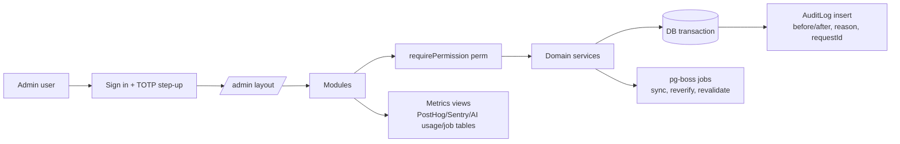

# Livo — Admin / Super Admin Specification

The admin is **the operating system of the MVP**: listings are created, verified and kept fresh here. It is built early (tasks 4–5), before the public UI is polished.

## 1. Architecture

Principles: same app & domain services (no separate admin backend); permission checks in the service layer (UI hiding is cosmetic); every mutation audited; PII masked by default; destructive actions need a reason and are reversible where possible (soft delete, unpublish).

## 2. RBAC

Permissions are strings `resource:action`. Roles are bundles; users can hold multiple roles. Seeded roles:

| Permission | Super Admin | Admin | Moderator | Data Manager | Support | Business Manager |
|---|---|---|---|---|---|---|
| dashboard:view | ✅ | ✅ | ✅ | ✅ | ✅ | ✅ |
| places:read | ✅ | ✅ | ✅ | ✅ | ✅ | ✅ |
| places:create / update | ✅ | ✅ | | ✅ | | ✅ (claimed/partner places) |
| places:verify | ✅ | ✅ | | ✅ | | |
| places:publish / reject | ✅ | ✅ | | ✅ | | |
| places:merge / delete | ✅ | ✅ | | ✅ (merge) | | |
| data:assumptions (cost/fare rules) | ✅ | ✅ | | ✅ | | |
| data:read / data:sync | ✅ | ✅ | | ✅ | | |
| jobs:read / jobs:retry | ✅ | ✅ | | ✅ | | |
| reports:read / reports:resolve | ✅ | ✅ | ✅ | ✅ | ✅ (read) | |
| reviews:moderate (V2) | ✅ | ✅ | ✅ | | | |
| business:verify (V1) | ✅ | ✅ | | | | ✅ |
| users:read | ✅ | ✅ | ✅ | | ✅ | |
| users:pii (unmasked email/phone) | ✅ | ✅ | | | ✅ (with reason, logged) | |
| users:suspend | ✅ | ✅ | ✅ | | | |
| guests:read | ✅ | ✅ | | | ✅ | |
| ai:read (usage/cost) | ✅ | ✅ | | ✅ | | |
| ai:content (read conversations) | ✅ | | | | ✅ (user-consented support case only) | |
| flags:manage | ✅ | ✅ | | | | |
| roles:manage | ✅ | | | | | |
| audit:read | ✅ | ✅ | | | | |
| system:read (health, security events) | ✅ | ✅ | | | | |
| settings:manage | ✅ | | | | | |

Rules: Super Admin role can only be granted by another Super Admin with re-auth; at least 2 Super Admins exist (break-glass); nobody can change their own roles; role changes notify all Super Admins by email.

## 3. Modules

| Module | MVP? | Key capabilities |
|---|---|---|
| **Dashboard** | ✅ | Users (total/new), active users (7/30d), guest sessions, plans created, searches, AI requests + tokens + ₹ cost today/MTD vs cap, maps/API calls vs free caps, contact clicks (proxy for bookings), reports open, **data freshness %**, failed jobs, error rate (Sentry API), system health (DB, Redis, OSRM, worker heartbeat). Revenue tile hidden until monetization. |
| **Places / Accommodations / Hotels-PGs** | ✅ | Table with filters (zone, kind, status, stale, source); editor with structured form (rooms, prices, deposit, food, amenities, rules), **map pin placement** with satellite toggle, photo upload/reorder/alt text, per-fact provenance entry ("verified by phone today"), status workflow (Draft → Pending review → Published / Rejected; Unverifiable; Closed), duplicate detection panel, change history (audit diff), preview as public. |
| **Food / restaurants** | ✅ | Same editor, food plans. |
| **Hospitals / pharmacies / services** | ✅ (light) | OSM-imported records to verify; hospital entrances; official links. |
| **Destinations (anchors)** | ✅ | Create anchors, aliases ("IP", "Infopark Phase II"), entrances; trigger travel precompute. |
| **Verification queue** | ✅ | Prioritized list (views × staleness); call script; one-click "still correct" / edit / mark unreachable; per-operator throughput. |
| **Review queue** | ✅ | New listings, partner submissions, automated suggested changes, probable duplicates (side-by-side merge). |
| **Reports** | ✅ | User reports triage: assign, resolve (fixed / invalid / duplicate), link to place edit. |
| **Data sources & sync jobs** | ✅ | Source registry with licence note/attribution; last sync status; trigger sync; view run stats/errors. |
| **Failed jobs** | ✅ | pg-boss failed/expired jobs; payload (redacted); retry / cancel. |
| **Cost assumptions & fare rules** | ✅ | Versioned editor (new version rows only, with effective date and source note); preview impact on sample plans. |
| **Users** | ✅ | Search, detail (masked), plans count, suspend/unsuspend (reason), deletion requests status. |
| **Guest sessions** | ✅ (read) | Counts, conversion rate, abuse flags. |
| **Roles / permissions** | ✅ | Assign roles; view matrix. |
| **Audit logs** | ✅ | Filter by actor, entity, action, date; diff viewer; export CSV (Super Admin). |
| **AI monitoring & costs** | ✅ | Requests, latency p50/p95, error/fallback rate, grounding violations, tokens and cost by task/model/day; top failing intents; conversation viewer (permissioned). Budget caps editor. |
| **API usage** | ✅ | Calls per external provider/SKU vs free cap and budget; cache hit rates. |
| **Feature flags** | ✅ | Boolean + percentage + role-targeted flags (AI chat, what-if levers, SEO pages). |
| **System health** | ✅ | Dependencies status, queue depth, DB slow queries (pg_stat_statements top 10), deploy version. |
| **Security events** | ✅ (basic) | Failed admin logins, 2FA failures, role changes, PII reveals, rate-limit bans. |
| **Settings** | ✅ | Freshness TTLs, rate limits, AI caps, contact reveal limits. |
| **Business listings / verification** | V1 | Claims queue, owner verification (call-back, document), ownership transfer. |
| **Moderation (reviews/UGC)** | V2 | Review queue, fraud signals, appeal handling. |
| **Notifications** | V1 | Templates, sends, bounces. |
| **Analytics** | V1 | Embedded PostHog dashboards (funnels: search → detail → add to plan → save). |

## 4. Key workflows

**Listing verification (MVP core loop)**
1. Operator opens queue item → sees current facts + last verification + call script.
2. Calls property; edits changed facts; sets `method=PHONE_CALL`; saves → per-fact provenance rows written; audit log; outbox → cache/SEO revalidation + travel recompute (if pin moved).
3. Unreachable twice → status `UNVERIFIABLE` (auto-hidden from Recommended; banner on detail).

**Publish**: Data Manager creates → status Pending review → a *different* user with `places:publish` approves (four-eyes, configurable off for Super Admin in early days).

**Suspend user**: reason required → sessions revoked → content hidden → email notice → audit entry.

## 5. Admin security
- Separate admin session cookie scope not needed (same auth), but `/admin` requires: admin role, **TOTP 2FA enrolled**, step-up within 12 h, re-auth within 10 min for `roles:manage`, `users:pii`, bulk ops, exports.
- Optional IP allowlist (flag) for admin routes.
- Admin rate limits separate from public.
- PII reveal requires reason; logged; shown in security events.
- No impersonation in MVP (support uses read-only views).
- Admin UI served with strict CSP; no third-party scripts on `/admin` except Sentry.
