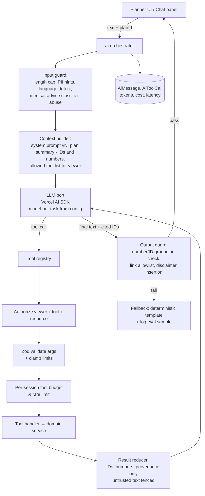
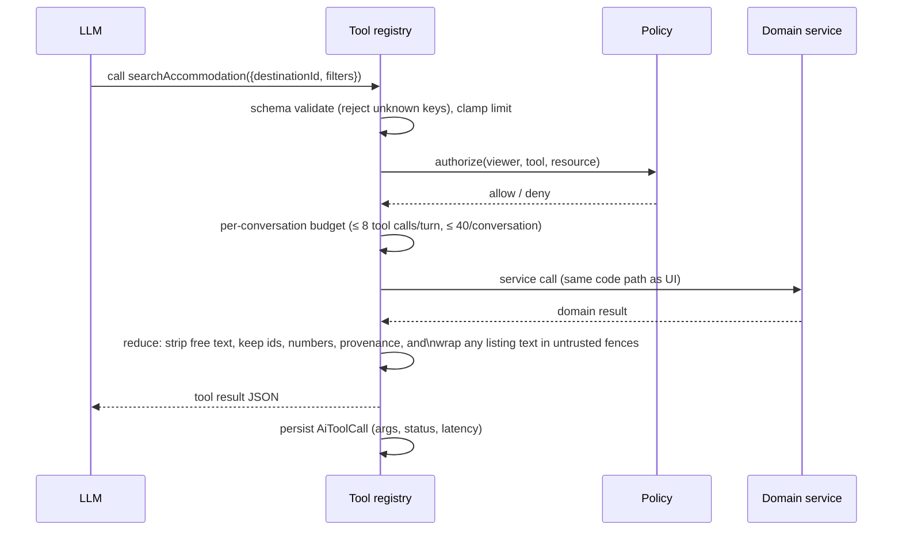

# Livo — AI Architecture

## 1. Principle

> **Real data → database/APIs → search/filter → deterministic calculations → AI reasoning/explanation.**

The LLM is a **translator and explainer**, never a source of facts. It turns messy human input into a validated structure, decides which controlled tools to call, and explains tool outputs in plain language. Every price, distance, time, availability and place it mentions must come from a tool result in the same turn.

What AI is **not** used for in MVP: ranking, pricing, generating listing descriptions shown as facts, reviews, medical anything, auto-writing to the database.

## 2. Features and MVP cut

| # | Feature | MVP? | Implementation |
|---|---|---|---|
| 1 | Natural-language planner (intake) | ✅ | `extractRequirements` → requirement summary form |
| 2 | Intent extraction | ✅ | Structured output → `TripRequirements` (Zod) |
| 3 | Location advisor ("which area should I stay in?") | ✅ (light) | Tool: `compareAreas` = deterministic aggregates per area (median rent, commute range, count); AI explains |
| 4 | Budget optimizer ("make it cheaper") | ✅ | Maps to what-if levers → `createScenario`; AI explains diff |
| 5 | Trade-off explanations | ✅ | Template-first (deterministic text), AI optional polish |
| 6 | What-if scenarios via language | ✅ | Parse into `ScenarioOverrides` |
| 7 | Dynamic plan editing ("switch to the second PG") | 🟡 V1 | `updatePlan` with confirmation |
| 8 | Checklist generator | 🟡 V1 | Mostly **static curated checklists per purpose** + AI personalization of ordering only |
| 9 | Local living advisor (Q&A about area) | 🟡 V1 | Retrieval over curated admin-authored area notes only (RAG with citations) |
| 10 | Emergency/quick planning mode | ✅ (non-AI) | "Tonight near X" = preset search (hotels/lodges open, ≤ 3 km); AI not needed |
| 11 | Comparison assistant | ✅ | Explain compare table; no winner declaration |
| 12 | Expense insights | V2 | After expense tracking exists |
| 13 | Preference learning | Future, opt-in | Explicit saved preferences first; learning only with consent |

## 3. Architecture



## 4. Intent extraction

Input: free text (English, Manglish, mixed Malayalam script tolerated), optionally the current plan.

Output schema (versioned; stored in `Plan.requirements`):

```ts
const TripRequirements = z.object({
  v: z.literal(1),
  purpose: z.enum(['JOB_RELOCATION','INTERVIEW','STUDY','HOSPITAL_ATTENDANT','INTERNSHIP',
                   'TRAINING','BUSINESS','FAMILY_VISIT','WORKATION','TRIP','OTHER']).nullable(),
  destinationText: z.string().max(200).nullable(),  // "Infopark" – resolved separately by geo module
  originCity: z.string().max(100).nullable(),       // "Kannur" – for travel-day checklist only
  startDate: z.string().date().nullable(),
  endDate: z.string().date().nullable(),
  durationDays: z.number().int().min(1).max(400).nullable(),
  people: z.number().int().min(1).max(20).default(1),
  genderPolicyNeeded: z.enum(['MEN','WOMEN','ANY','FAMILY']).nullable(),
  monthlyIncomeInr: z.number().int().min(0).max(10_000_000).nullable(),
  budget: z.object({ amountInr: z.number().int().min(0), period: z.enum(['MONTH','TRIP','DAY']) }).nullable(),
  cashOnHandInr: z.number().int().min(0).nullable(),
  accommodation: z.object({
    kinds: z.array(z.enum(['PG','HOSTEL','COLIVING','ROOM_RENTAL','LODGE','HOTEL','SERVICE_APARTMENT'])).default([]),
    occupancy: z.enum(['SINGLE','SHARED','ANY']).default('ANY'),
    ac: z.enum(['REQUIRED','PREFERRED','NO']).nullable(),
    privateBath: z.boolean().nullable(),
    foodIncluded: z.enum(['REQUIRED','PREFERRED','NO']).nullable(),
  }),
  food: z.object({ diet: z.enum(['VEG','NON_VEG','ANY']).default('ANY'), mealsPerDay: z.number().int().min(0).max(4).nullable() }),
  transport: z.object({ hasVehicle: z.enum(['NONE','TWO_WHEELER','CAR']).nullable(),
                        preferredModes: z.array(z.enum(['WALK','BUS','METRO','AUTO','CAB','OWN'])).default([]),
                        maxCommuteMin: z.number().int().min(5).max(180).nullable() }),
  constraints: z.array(z.string().max(120)).max(10),   // free-text residue shown to user, never used as filter
  missing: z.array(z.string()),                        // fields the model thinks are needed
  confidence: z.record(z.string(), z.enum(['HIGH','MEDIUM','LOW'])),
});
```

Example: *"I got a 15k job near Infopark and need a PG for 3 months. I don't have a bike."* →
`purpose=JOB_RELOCATION, destinationText="Infopark", monthlyIncomeInr=15000, durationDays=90, accommodation.kinds=[PG], transport.hasVehicle=NONE, preferredModes=[WALK,BUS,METRO,AUTO], missing=[startDate, exact office (Phase 1/2), budget, gender policy]`.

Rules:
- **The summary is always shown and editable** before searching. AI output never silently becomes filters.
- Destination text is resolved by the `geo` module (anchor alias table first — "Infopark", "IP Phase 2", "Kakkanad Infopark" → anchor; then geocoder). If ambiguous (Phase 1 vs Phase 2), UI asks with a chip picker.
- Low-confidence fields are highlighted.
- If extraction fails or times out (> 6 s), the user gets the plain form pre-filled with whatever parsed; the product works fully without AI.

## 5. Tool registry

| Tool | Type | Args (Zod, clamped) | Auth | Returns (reduced) |
|---|---|---|---|---|
| `resolveDestination` | read | `text ≤200` | any | candidates `{destinationId, name, kind}` ≤5 |
| `searchAccommodation` | read | destinationId, filters, sort, `limit ≤ 10` | any | `[{placeId, roomId, name, monthlyPaise, depositPaise, doorToDoorMin:[min,max], mode, provenance}]` |
| `searchFood` | read | destinationId or placeId, diet, `limit ≤ 10` | any | similar |
| `searchPlaces` (services) | read | category ∈ allowlist, near, `limit ≤ 10` | any | name, distance, open-now if known |
| `getRoute` | read | originPlaceId, destinationId, mode | any | duration range, distance, fare range, method |
| `compareAreas` | read | destinationId, areaIds ≤5 | any | per-area medians & ranges, sample sizes |
| `calculateBudget` | read (pure) | BudgetInput | any | BudgetResult summary |
| `compareOptions` | read | placeIds 2–3 + plan context | any | structured diff table |
| `getPlan` | read | planId | owner (user/guest) or share token (read-only) | plan summary |
| `createScenario` | write (own plan) | planId, ScenarioOverrides | owner | scenarioId + diff |
| `updatePlan` | write (own plan) **V1** | planId, patch (limited ops: set item, set dates, set mode) | owner + **user confirmation** | proposed change; applied only after UI confirm |

Not available to AI at all: admin tools, user data other than the viewer's, raw SQL, HTTP fetch, email sending, anything under `/admin`.

Tool execution:



Write tools produce **proposals**; the UI renders a diff and a confirm button (server action executes the same service with the user's session — the AI cannot execute the mutation by itself).

## 6. Grounding & output guard

1. Every tool result carries a `groundingSet`: all numbers (paise → rupee renderings in multiple formats, minutes, km) and IDs.
2. The model is instructed to reference places as `[[place:ID]]` tokens; the UI renders them as cards (name/price pulled from DB, not from model text).
3. Output guard extracts all currency amounts, durations and distances from the final text; any value not within the grounding set (tolerance: exact after rounding to nearest ₹10 / minute) → response rejected → deterministic template fallback, sample logged for evals.
4. Place tokens referencing IDs not in this turn's tool results → rejected.
5. Links: only internal routes allowed.
6. Medical classifier: if the user asks medical/clinical questions, reply with a fixed logistics-only message + suggest contacting the hospital; hospital-attendant plans show a persistent disclaimer.

## 7. Prompt-injection & abuse defenses

- Listing text, owner-provided descriptions, user reports and area notes are **untrusted**: they are never placed in the system prompt; in tool results they are fenced and summarized, and MVP tools return **no free text** at all (only structured fields).
- System prompt states tool-use policy; policy is **enforced in code** (registry), not trusted to the prompt.
- No tool can reach the network or file system; no tool accepts URLs (SSRF impossible by construction).
- Per-viewer limits: guest 20 AI turns/day, user 60/day, token cap per turn (input 8k, output 1k), conversation length cap (summarize beyond 20 turns).
- Cost circuit breaker: global daily spend cap per task in config; when hit, AI features degrade to form + templates with a banner.
- Jailbreak/abuse content → refusal template; repeated abuse → session AI disabled 24 h.
- Red-team suite in CI (see Testing): injection strings embedded in seeded listing names/notes must not change tool calls or output.

## 8. Model routing & cost

| Task | Model class | Why | Budget |
|---|---|---|---|
| `intent_extraction` | small/fast model with strict structured output | high volume, simple schema | ≤ 1.5k in / 500 out tokens |
| `plan_chat` (tool loop, explanations) | stronger mid-tier model | reasoning over tool results | ≤ 8k in / 1k out per turn |
| `explanation_polish` | small model or none (templates) | often unnecessary | optional |
| evals / offline | strongest available | grading | offline |

Defaults: Claude family via Vercel AI SDK provider (small model for extraction, mid-tier for chat), OpenAI/Gemini configured as failover. Exact model IDs live in `src/config/ai.ts`, never scattered in code. Use provider prompt caching for the static system prompt + tool definitions.

Cost formula for planning: `cost/plan ≈ extraction (1 call) + chat turns × (in_tokens × price_in + out_tokens × price_out)`. With ~3 chat turns/plan and the budgets above, cost per engaged plan should be a small fraction of a rupee-to-few-rupees range depending on model; **compute with current provider pricing at build time** and set the daily cap accordingly.

## 9. Evaluation

- Dataset: 200 utterances (collected from ops conversations + synthetic variants), labelled target `TripRequirements`. Include: Manglish ("15k salary aanu, Infopark nu aduthu PG venam"), dates like "next Monday", "from 1st", budgets like "10-12k", attendants ("amma admitted in Aster, need place to stay 2 weeks").
- Metrics: exact-match per field, destination resolution accuracy, false-medical-advice rate (must be 0), grounding violations (must be 0 in released builds), tool-call validity rate, latency p95, cost per turn.
- Gate: prompt/model changes merge only if metrics don't regress beyond thresholds (CI job with provider key in protected env).

## 10. Failure modes

| Failure | Behaviour |
|---|---|
| Provider down / timeout | failover provider; then form-only mode |
| Invalid structured output | one repair retry with validation errors; then partial fill |
| Tool error | model gets `{error: code}`; explains without inventing |
| Grounding violation | template fallback |
| Budget cap hit | AI disabled banner; all deterministic features continue |
