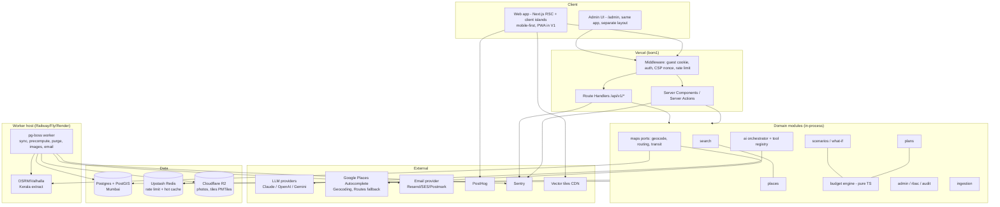
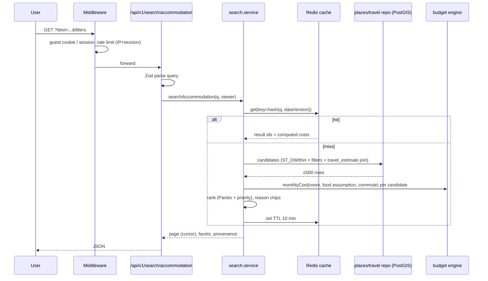
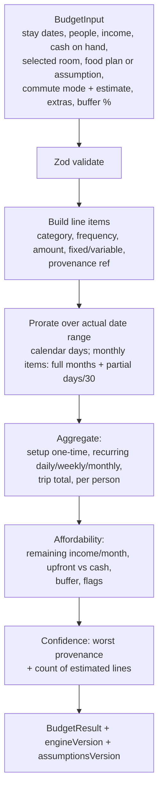
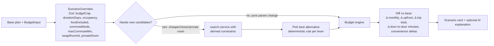
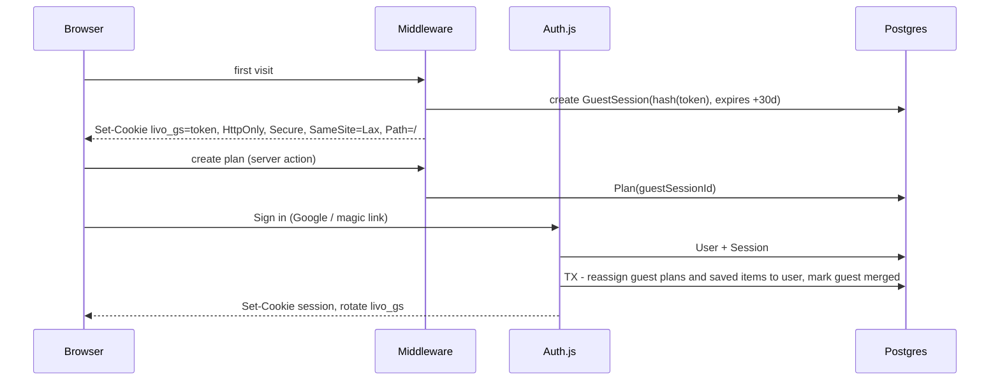
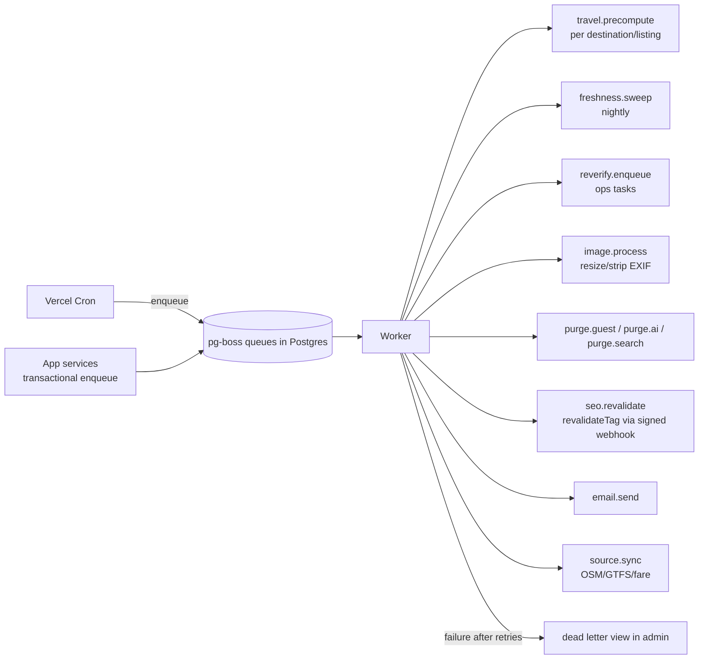
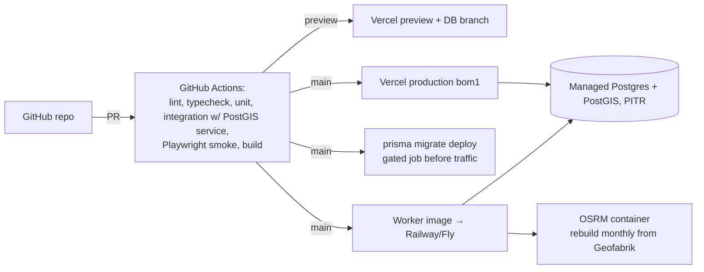

# Livo — Architecture

Companion to [MASTER_PLAN.md](./MASTER_PLAN.md). Decisions referenced as ADR-xxx live in [DECISIONS.md](./DECISIONS.md).

## 0. Starting point

The `nihal-spec/Livo` repository was **empty** at planning time (no commits, no branches, no code). There is no existing infrastructure to reuse and no technical debt. Everything below is greenfield; the first tasks create the skeleton.

## 1. System architecture



## 2. Module boundaries

Each module lives in `src/modules/<name>/` and exposes **only** `index.ts` (public service functions + types). Other modules import nothing else from it. Enforced by lint rule.

| Module | Owns (tables) | Public API (examples) | Depends on |
|---|---|---|---|
| `auth` | User, Account, Session, GuestSession | `getViewer()`, `requireUser()`, `mergeGuestIntoUser()` | — |
| `rbac` | Role, RolePermission, UserRole | `can(viewer, perm)`, `requirePermission()` | auth |
| `audit` | AuditLog | `withAudit(tx, entry)` | — |
| `geo` (destinations/regions) | Region, Destination | `resolveDestination(input)`, `getAnchor(slug)` | maps |
| `maps` | (cache only) | ports: `Geocoder`, `Autocomplete`, `RoutingProvider`, `TransitEstimator` | external |
| `places` | Place, AccommodationDetail, RoomOption, FoodPlan, Amenity, PlacePhoto, FactProvenance | `getPlace()`, `listNearby()`, `provenanceFor()` | geo |
| `travel` | TravelEstimate, FareRule, TransitStop | `estimate(origin, dest, modes)`, `precompute(destId)` | maps, places |
| `search` | SearchEvent | `searchAccommodation(q)`, `searchFood(q)`, `searchServices(q)` | places, travel, budget |
| `budget` | CostAssumption, BudgetSnapshot | `calculateBudget(input) → BudgetResult` (**pure**) | none at runtime (inputs injected) |
| `plans` | Plan, PlanItem, Scenario | `createPlan`, `updatePlan`, `addItem`, `share` | budget, places, travel |
| `scenarios` | (uses Scenario) | `applyScenario(plan, overrides)`, `compareScenarios()` | budget, search |
| `ai` | AiConversation, AiMessage, AiToolCall | `extractRequirements(text)`, `chat(planId, msg)` | via tool registry only: search, plans, budget, scenarios |
| `saved` | SavedPlace | | places |
| `reports` | Report | | places |
| `admin` | FeatureFlag | admin-only services composing others | rbac, audit, all |
| `ingestion` | DataSource, SyncRun, staging tables | adapters, dedupe | places, geo |
| `notifications` (V1) | Notification | | |
| `expenses` (V1), `reviews` (V2), `bookings` (future) | | | |

Rules:
- **Service layer** (`service.ts`) holds business rules and authorization checks; **repository** (`repository.ts` + `sql/*.sql`) holds data access; **route handlers/server actions** are thin: parse (Zod) → call service → map errors.
- Cross-module writes happen only through the owning module's service.
- The `budget` package is framework-free and deterministic → unit-testable with golden files and reusable client-side for instant what-if previews.

## 3. Request flow (search)



## 4. Search & ranking

```mermaid
flowchart LR
  Q[Query: destination, dates, people,\nbudget, filters, priority] --> D[Resolve destination\nanchor or geocoded pin]
  D --> PF[Pre-filter PostGIS\nradius by mode, status, hard filters]
  PF --> TT[Attach travel estimates\nprecomputed or on-demand top-N]
  TT --> FC[Full cost per candidate\nrent + food + commute\ndeposit shown separately]
  FC --> HC[Hard constraints\nmax commute, max monthly, gender policy]
  HC --> PR[Pareto front on cost x time]
  PR --> OR[Order by user priority\nthen distance tie-break]
  OR --> RC[Reason chips from rules]
  RC --> OUT[Results + facets + map pins]
```



Sort options map to deterministic keys:

| Sort | Key |
|---|---|
| Recommended | Pareto rank → priority metric → door-to-door time |
| Lowest price | room price (basis-normalized to monthly or nightly depending on stay length) |
| Lowest total cost | rent + food + commute for the stay (budget engine) |
| Closest | door-to-door time (fallback distance if no estimate) |
| Best value | cost per "comfort feature" is **not** used (meaningless); instead: lowest total cost among listings meeting all preferred amenities |
| Best rated | V2 only (hidden until reviews exist) |

Radius defaults by chosen commute mode: walk 2.5 km, bus/metro 12 km, two-wheeler 15 km, "any" 10 km; user can widen.

## 5. Budget engine



Contract (TypeScript):

```ts
type Frequency = 'ONE_TIME' | 'DAILY' | 'WEEKLY' | 'MONTHLY' | 'PER_NIGHT' | 'PER_MEAL';
type Category = 'ACCOMMODATION' | 'DEPOSIT' | 'FOOD' | 'TRANSPORT' | 'ACTIVITIES' | 'LAUNDRY'
  | 'GROCERIES' | 'MOBILE_DATA' | 'ESSENTIALS' | 'MEDICAL_LOGISTICS' | 'MISC' | 'EMERGENCY_BUFFER';

interface LineItem {
  id: string; category: Category; label: string;
  amountPaise: bigint; frequency: Frequency; quantityPerFrequency?: number; // e.g. 2 meals/day
  kind: 'FIXED' | 'VARIABLE';
  refundable?: boolean;                // deposits
  provenance: { sourceType: SourceType; ref: string; observedAt?: string; stale: boolean };
}
interface BudgetResult {
  days: number; months: number;        // months = days/30 display-only
  setupPaise: bigint;                  // one-time incl. deposit, first month advance if applicable
  refundablePaise: bigint;
  recurring: { dailyPaise: bigint; weeklyPaise: bigint; monthlyPaise: bigint };
  tripTotalPaise: bigint; perPersonTotalPaise: bigint;
  byCategory: Record<Category, bigint>;
  affordability?: { monthlyIncomePaise: bigint; remainingMonthlyPaise: bigint;
                    upfrontShortfallPaise: bigint; bufferPaise: bigint; flags: AffordabilityFlag[] };
  confidence: { level: 'HIGH'|'MEDIUM'|'LOW'; estimatedLines: number; staleLines: number };
  engineVersion: string; assumptionsVersion: string;
}
```

Rules worth fixing now:
- Rounding: compute in paise, round **half-up per line after proration**, sum rounded lines (totals equal visible sum).
- PG rent: many Kochi PGs charge **first month + deposit upfront**; `setupPaise` includes both; monthly cost excludes deposit; refundable shown separately.
- Stays < 30 days at a monthly-priced PG: flag `MONTHLY_MIN_CHARGE` (you pay the full month) unless the listing has a per-day rate.
- Food included in rent: food line = 0 with note; partial meals (e.g., breakfast+dinner) → assumption covers lunch.
- Commute: `tripsPerWeek` (default 5 for office, 7 for hospital attendant, custom) × 2 × fare; walking = 0.
- Emergency buffer: default 10% of monthly recurring (user-editable), shown as its own line, not hidden inside totals.
- Salary: remaining = income − monthly recurring; **never** subtract deposit from monthly salary silently — separate "upfront needed" figure.

## 6. What-if engine



Levers and their deterministic rules:

| Lever | Rule |
|---|---|
| Cheaper PG | Same constraints, `totalMonthly < base × 0.9`, minimise added commute time |
| Closer PG | `doorToDoor < base − 10 min`, minimise added monthly cost |
| Food included | Filter `foodIncluded = true`, compare vs base (rent + food) |
| Longer/shorter stay | Recompute with new `endDate`; re-check min stay and per-day pricing |
| Public transport | Change mode; recompute commute cost & time; flag if > maxCommute |
| Private room | occupancy = SINGLE; cheapest match within constraints |
| Different budget | New cap → re-run search; if nothing fits, report nearest-miss (how much over) |

Pure parameter changes run **client-side** with the same budget package for instant feedback; lever changes needing new candidates call the API.

## 7. Auth



Admin access: `/admin/*` requires a user session with ≥1 admin role **and** TOTP verified within the last 12 h (step-up); sensitive actions (role grants, user suspension, bulk publish) require re-auth within 10 min.

## 8. Background jobs



Defaults: `retryLimit 5`, exponential backoff from 30 s, `expireIn` per job type, singleton keys for dedupe (`travel.precompute:{placeId}`), all handlers idempotent.

## 9. Deployment



- Environments: `local` (docker-compose: postgis, osrm, mailpit), `preview`, `staging` (optional until V1), `production`.
- Config: all env vars declared in `src/config/env.ts` (Zod); app refuses to boot on invalid config.
- Migrations: expand/contract; never destructive in same release as code relying on it.

## 10. Folder structure

```
livo/
├─ apps/
│  ├─ web/                          # Next.js app (web + API + admin)
│  │  ├─ src/app/
│  │  │  ├─ (public)/               # landing, SEO pages, search, place pages
│  │  │  ├─ (planner)/plan/[id]/    # plan builder, budget, scenarios, compare
│  │  │  ├─ (account)/              # saved, profile, preferences
│  │  │  ├─ admin/                  # admin layout + modules
│  │  │  └─ api/v1/                 # route handlers (thin)
│  │  ├─ src/components/
│  │  │  ├─ ui/                     # shadcn primitives (owned copies)
│  │  │  ├─ patterns/               # CostBreakdown, ProvenanceChip, ListingCard, CompareTable, BottomSheet
│  │  │  └─ map/                    # MapLibre wrapper, pins, clusters
│  │  ├─ src/modules/               # domain modules (see §2) – service, repository, schemas, index.ts
│  │  ├─ src/ai/                    # llm port, prompts/, tools/, guards/, evals/
│  │  ├─ src/config/                # env.ts, flags.ts, constants
│  │  ├─ src/lib/                   # money, dates, errors, logger, rate-limit, http
│  │  ├─ src/i18n/                  # next-intl messages (en; ml/hi later)
│  │  └─ tests/e2e/                 # Playwright
│  └─ worker/                       # pg-boss worker entry; imports modules from web via packages
├─ packages/
│  ├─ budget-engine/                # pure TS, zero deps except zod; golden tests
│  ├─ schemas/                      # shared Zod schemas (TripRequirements, ScenarioOverrides, API DTOs)
│  └─ db/                           # prisma/schema.prisma, migrations, sql/ (TypedSQL), seed/
├─ infra/                           # docker-compose, osrm build script, env docs
├─ docs/planning/                   # these documents
└─ .github/workflows/
```

Monorepo via pnpm workspaces + Turborepo (only because worker and web share modules and the budget engine is reused client-side). If this proves heavy, collapse `worker` into `apps/web/src/worker` with a separate entrypoint.

## 11. Caching

| What | Where | Key | TTL | Invalidation | Stale handling |
|---|---|---|---|---|---|
| Search results | Redis | `s:v{dataVersion}:{hash(normalizedQuery)}` | 10 min | `dataVersion` bumped on any publish in region (outbox) | serve stale ≤ 1 h if DB slow (SWR) |
| Place detail (public) | Next.js data cache / ISR | tag `place:{id}` | 1 h | `revalidateTag` on update | ISR stale-while-revalidate |
| SEO pages | ISR | tag `anchor:{slug}` | 6 h | on publish in radius | |
| Geocode (our own resolution of user input) | Redis | `geo:{provider}:{normalizedText}` | per provider ToS (Google: store `place_id` only; resolve coords on use or within allowed window) | — | |
| Autocomplete | client debounce + session tokens | — | none server-side | — | |
| Our routing (OSRM) on-demand | Postgres `travel_estimate` + Redis | `(origin,dest,mode,band)` | 30 days / until listing moves | recompute on location change | |
| Fare rules, cost assumptions, amenities | in-memory per instance | version | 5 min | version bump | |
| AI responses | **not cached** (except extraction of identical text, 1 h, per session) | | | | |

## 12. Performance targets

| Area | Target |
|---|---|
| LCP (mobile, 4G, Moto G-class) | ≤ 2.5 s p75 on landing, search, place pages |
| INP | ≤ 200 ms p75 |
| CLS | ≤ 0.1 |
| JS on landing | ≤ 120 KB gz first load; map bundle lazy-loaded only on search/map views |
| Search API | p50 ≤ 150 ms, p95 ≤ 400 ms (cache miss), ≤ 50 ms hit |
| Other read APIs | p95 ≤ 250 ms |
| DB queries | p95 ≤ 50 ms; any > 200 ms logged with plan |
| Budget recompute (client) | ≤ 16 ms |
| AI intent extraction | p95 ≤ 4 s; UI shows form immediately, fills when ready |
| AI chat first token | ≤ 2.5 s p95 (streaming) |
| Map first render | ≤ 1.5 s after view open; ≤ 300 pins client-side, clustered |
| Images | AVIF/WebP, responsive `sizes`, ≤ 80 KB per card image |

## 13. Observability

- **Logs:** pino JSON, `requestId`, `viewerType` (guest/user/admin), module, latency; redaction list (`authorization`, `cookie`, `email`, `phone`, `token`, prompts' user text truncated/hashed in prod).
- **Errors:** Sentry (web, server, worker) with release + source maps; PII scrubbing on.
- **Metrics/dashboards:** API latency by route; external API calls/latency/errors per provider; AI tokens/cost/latency per task & model; job throughput/failures per queue; data freshness %; auth failures; admin sensitive actions.
- **Alerts:** search p95 > 800 ms 10 min; 5xx > 1% 5 min; AI daily spend > budget × 0.8; job DLQ > 0 for sync jobs; freshness SLO breach; spike in failed admin logins.
- **Uptime:** synthetic checks on `/api/health` (DB, Redis, OSRM reachability) and a search smoke query.

## 14. Testing strategy

| Layer | Tooling | What |
|---|---|---|
| Unit | Vitest | budget engine (golden-file cases: short stay, monthly-min, food included, zero income, huge deposit), ranking, fare rules, Zod schemas |
| Integration / DB | Vitest + Testcontainers `postgis/postgis` | repositories, geo queries, constraints, soft delete, guest merge transaction |
| API | Vitest + route handler invocation | auth, permissions matrix, validation errors, pagination, rate-limit responses |
| AI structured output | eval suite (fixtures of 150+ real-style utterances incl. Manglish/Malayalam-English mix) | field-level accuracy of `TripRequirements`, refusal of medical questions, no hallucinated IDs |
| AI tools | unit tests on tool handlers; adversarial prompts (injection in listing text, "ignore instructions", data exfil) | |
| Security | ZAP baseline in CI (weekly), dependency audit, secret scanning, authz tests per permission | |
| E2E | Playwright: guest search → compare → plan → sign in → saved; admin create → verify → publish | |
| Responsive | Playwright projects at 360, 375, 390, 414, 768, 1024, 1440, 1920 with screenshot diff on key screens | |
| Accessibility | axe-core in Playwright; manual screen reader pass (NVDA + VoiceOver) per release | |
| Performance | Lighthouse CI budgets on 3 pages; k6 load test for search (100 RPS) before launch | |
| Regression | snapshot of budget results for seed plans (engine version bump requires snapshot update review) | |
