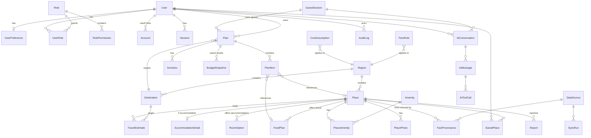

# Livo — Database Design

PostgreSQL 16+ with PostGIS 3.x, `pg_trgm`, `citext`, `pgcrypto`. Prisma for schema/migrations/CRUD; PostGIS columns via `Unsupported(...)` and hand-edited migration SQL (see ADR-003).

## 1. Entity pruning (what we keep, merge, or defer)

The brief lists ~40 candidate entities. Many are the same thing with different labels. Decisions:

| Candidate | Decision | Reason |
|---|---|---|
| Place, Accommodation, FoodProvider, Hospital, Pharmacy, ServiceProvider, Business | **Merge into `Place` + category + typed detail tables** (`AccommodationDetail`, `FoodDetail`) | One geo table, one search index, one provenance model. Hospitals/pharmacies need no special columns beyond category + a few attributes (JSONB). |
| AccommodationType | **Enum** `AccommodationKind` | Small fixed set, changes need code anyway. |
| AccommodationAmenity | **`Amenity` + `PlaceAmenity` join** | Filterable; admin-extendable. |
| FoodOption | **`FoodPlan`** (meal plans/prices offered by a food place) | |
| TransportOption | **Not a table of options**; `TransitStop`, `FareRule`, `TravelEstimate` | Transport is computed, not listed. |
| Destination, Location | **`Destination`** (anchor POIs & user pins) + **`Region`** (city/area) | "Location" is just coordinates — a column, not an entity. |
| Trip, TripPurpose, Plan | **Merge Trip into `Plan`**; purpose = enum | A "trip" without a plan has no behaviour. |
| PlanItem | **Keep** | Selected accommodation/food/transport choices. |
| Budget, BudgetCategory | **`Budget` is computed, not stored**; store `BudgetSnapshot` (JSON result + inputs hash) on save; categories = enum | Deterministic engine; storing derived rows invites drift. |
| Expense | **V1** | Tracking is post-MVP. |
| Scenario | **Keep** (`Scenario` = named overrides on a plan) | |
| SavedPlace | **Keep** | |
| Review, Rating | **V2** (`Review` with rating column; no separate Rating table) | Fake-review risk; needs moderation ops. |
| Booking | **Defer**; V1 `OutboundClick` for affiliate/contact tracking | We don't take bookings in MVP. |
| BusinessListing, BusinessVerification | **V1** `BusinessClaim` (claim an existing Place) | Self-listing is post-MVP. |
| AIConversation, AIMessage, AIRecommendation | **`AiConversation`, `AiMessage`**, plus `AiToolCall`; recommendations are tool outputs, not a table | |
| SearchHistory | **`SearchEvent`** (minimal, pseudonymous, 90-day retention) | Analytics lives in PostHog; DB copy only for relevance debugging. |
| Notification | **V1** | |
| Report | **Keep (MVP-light)**: "report wrong info" | Cheapest freshness signal. |
| DataSource, DataSyncJob | **`DataSource`, `SyncRun`**; jobs themselves live in pg-boss tables | |
| AdminUser, AdminRole, AdminAuditLog | **No separate AdminUser** — `User` + `UserRole` + `Role` + `RolePermission`; **`AuditLog`** | One identity; admin = user with roles + 2FA. |
| UserPreference | **Keep** (single row per user, JSONB validated by Zod) | |
| GuestSession | **Keep** | |

## 2. ERD



## 3. Core tables (Prisma sketch)

> Sketch — types and relations are final-intent; exact field names may shift during task 2. Soft-delete + audit columns are shown once in `Place` and apply to all mutable business tables.

```prisma
enum PlaceCategory { ACCOMMODATION FOOD HOSPITAL PHARMACY DIAGNOSTICS GROCERY LAUNDRY ATM COWORKING GYM TRANSIT_HUB OTHER }
enum AccommodationKind { PG HOSTEL COLIVING ROOM_RENTAL LODGE HOTEL SERVICE_APARTMENT DORMITORY }
enum Occupancy { SINGLE DOUBLE TRIPLE DORM_4PLUS WHOLE_UNIT }
enum GenderPolicy { MEN WOMEN ANY FAMILY }
enum FoodKind { MESS TIFFIN RESTAURANT CLOUD_KITCHEN MEAL_SUBSCRIPTION GROCERY }
enum PriceBasis { PER_NIGHT PER_WEEK PER_MONTH PER_MEAL PER_DAY }
enum PlaceStatus { DRAFT PENDING_REVIEW PUBLISHED UNVERIFIABLE CLOSED REJECTED }
enum SourceType { VERIFIED PARTNER API ESTIMATED USER IMPORTED }
enum TravelMode { WALK TWO_WHEELER CAR AUTO CAB BUS METRO WATER_METRO MIXED_TRANSIT }
enum PlanPurpose { JOB_RELOCATION INTERVIEW STUDY HOSPITAL_ATTENDANT INTERNSHIP TRAINING BUSINESS FAMILY_VISIT WORKATION TRIP OTHER }

model Region {
  id        String  @id @default(cuid())
  kind      String  // CITY | AREA
  slug      String  @unique
  name      String
  parentId  String?
  boundary  Unsupported("geography(MultiPolygon,4326)")?
  centroid  Unsupported("geography(Point,4326)")
}

model Destination {
  id           String  @id @default(cuid())
  slug         String? @unique           // anchors only (SEO)
  name         String
  kind         String                    // OFFICE_PARK | HOSPITAL | COLLEGE | STATION | EVENT | CUSTOM
  regionId     String
  location     Unsupported("geography(Point,4326)")
  entrances    Json?                     // [{label, lat, lng}] – gates matter for hospitals/parks
  isAnchor     Boolean @default(false)
  externalPlaceId String?                // e.g. Google place_id (ToS-permitted to store)
  createdByUserId String?                // custom pins
}

model Place {
  id            String        @id @default(cuid())
  slug          String        @unique
  category      PlaceCategory
  name          String
  regionId      String
  location      Unsupported("geography(Point,4326)")
  addressLine   String
  landmark      String?
  phoneE164     String?
  whatsappE164  String?
  website       String?
  status        PlaceStatus   @default(DRAFT)
  isSponsored   Boolean       @default(false)   // V1; never affects "Recommended" order
  attributes    Json?         // category-specific, Zod-validated (e.g. pharmacy 24x7)
  openingHours  Json?
  // audit & lifecycle
  createdAt     DateTime @default(now())
  updatedAt     DateTime @updatedAt
  createdById   String?
  updatedById   String?
  deletedAt     DateTime?
  version       Int      @default(1)          // optimistic locking in admin editor
  @@index([category, status])
  @@index([regionId])
}

model AccommodationDetail {
  placeId        String @id
  kind           AccommodationKind
  genderPolicy   GenderPolicy
  foodIncluded   Boolean?
  mealsIncluded  String[]            // BREAKFAST | LUNCH | DINNER
  minStayDays    Int?
  noticeDays     Int?
  curfew         String?
  rules          String?
}

model RoomOption {                    // a PG has several: 2-sharing non-AC, single AC…
  id            String @id @default(cuid())
  placeId       String
  occupancy     Occupancy
  ac            Boolean
  privateBath   Boolean
  priceBasis    PriceBasis
  pricePaise    BigInt
  depositPaise  BigInt?
  maintenancePaise BigInt?          // one-time or monthly, see basis field
  electricityIncluded Boolean?
  availableBeds Int?
  provenanceId  String              // FactProvenance for price
  @@index([placeId])
  @@index([pricePaise])
}

model FoodPlan {
  id           String @id @default(cuid())
  placeId      String
  kind         FoodKind
  meals        String[]
  vegOnly      Boolean?
  priceBasis   PriceBasis
  pricePaise   BigInt
  delivers     Boolean?
  deliveryRadiusM Int?
  timings      Json?
  provenanceId String
}

model FactProvenance {
  id             String @id @default(cuid())
  placeId        String
  factKey        String      // e.g. "room:ckx..:price", "accommodation:foodIncluded"
  sourceType     SourceType
  dataSourceId   String
  observedAt     DateTime
  verifiedAt     DateTime?
  verifiedById   String?
  method         String?
  confidence     String      // HIGH | MEDIUM | LOW
  note           String?
  @@index([placeId, factKey])
  @@index([observedAt])
}

model TravelEstimate {
  originPlaceId  String
  destinationId  String
  mode           TravelMode
  departBand     String      // PEAK_AM | OFFPEAK | PEAK_PM
  durationSMin   Int
  durationSMax   Int
  distanceM      Int
  farePaiseMin   BigInt?
  farePaiseMax   BigInt?
  method         String      // OSRM | GTFS | RULE | GOOGLE_CALIBRATED
  computedAt     DateTime
  @@id([originPlaceId, destinationId, mode, departBand])
  @@index([destinationId, mode, durationSMin])
}

model Plan {
  id              String   @id @default(cuid())
  ownerUserId     String?
  guestSessionId  String?
  title           String
  purpose         PlanPurpose
  destinationId   String
  startDate       DateTime @db.Date
  endDate         DateTime @db.Date
  people          Int      @default(1)
  requirements    Json     // TripRequirements (Zod, versioned: {v:1,...})
  monthlyIncomePaise BigInt?
  budgetCapPaise  BigInt?
  cashOnHandPaise BigInt?
  shareToken      String?  @unique   // unguessable, revocable
  status          String   @default("DRAFT") // DRAFT | ACTIVE | ARCHIVED
  createdAt       DateTime @default(now())
  updatedAt       DateTime @updatedAt
  deletedAt       DateTime?
  @@index([ownerUserId])
  @@index([guestSessionId])
}
// CHECK constraint (migration SQL): num_nonnulls(owner_user_id, guest_session_id) = 1
// CHECK: end_date >= start_date; people BETWEEN 1 AND 20

model PlanItem {
  id         String @id @default(cuid())
  planId     String
  kind       String      // ACCOMMODATION | FOOD | TRANSPORT | CUSTOM_COST
  placeId    String?
  roomOptionId String?
  foodPlanId String?
  travelMode TravelMode?
  custom     Json?       // user-entered cost line: {label, amountPaise, frequency}
  position   Int
}

model Scenario {
  id        String @id @default(cuid())
  planId    String
  name      String
  overrides Json         // ScenarioOverrides (Zod) – see Budget/What-if spec
  createdAt DateTime @default(now())
}

model BudgetSnapshot {
  id           String @id @default(cuid())
  planId       String
  scenarioId   String?
  engineVersion String
  assumptionsVersion String
  inputsHash   String
  result       Json     // BudgetResult
  createdAt    DateTime @default(now())
  @@index([planId, createdAt])
}

model CostAssumption {
  id           String @id @default(cuid())
  key          String
  regionId     String
  valuePaise   BigInt
  p25Paise     BigInt?
  p75Paise     BigInt?
  unit         String
  effectiveFrom DateTime
  effectiveTo  DateTime?
  sourceNote   String
  confidence   String
  @@index([key, regionId, effectiveFrom])
}

model FareRule {            // auto/metro/bus/cab rule parameters, versioned like CostAssumption
  id String @id @default(cuid())
  regionId String
  mode TravelMode
  params Json               // {minFarePaise, minKm, perKmPaise, nightMultiplier, slabs:[...]}
  effectiveFrom DateTime
  effectiveTo DateTime?
  sourceNote String         // e.g. govt order number
}

model GuestSession {
  id          String   @id           // sha256(cookie value)
  createdAt   DateTime @default(now())
  lastSeenAt  DateTime
  expiresAt   DateTime
  mergedIntoUserId String?
  uaHash      String?                 // coarse, for abuse detection; no raw IP stored
  @@index([expiresAt])
}

model User {
  id          String @id @default(cuid())
  email       String @unique          // citext in migration
  name        String?
  image       String?
  status      String @default("ACTIVE") // ACTIVE | SUSPENDED | DELETION_PENDING
  totpSecretEnc Bytes?                // admins only, envelope-encrypted
  createdAt   DateTime @default(now())
  deletedAt   DateTime?
}
// + Auth.js tables: Account, Session, VerificationToken

model Role { id String @id; key String @unique; name String }
model RolePermission { roleId String; permission String; @@id([roleId, permission]) }
model UserRole { userId String; roleId String; grantedById String; grantedAt DateTime @default(now()); @@id([userId, roleId]) }

model AuditLog {
  id          BigInt   @id @default(autoincrement())
  actorUserId String?
  actorType   String   // USER | ADMIN | SYSTEM | AI_TOOL
  action      String   // "place.update", "user.suspend", "role.grant"
  entityType  String
  entityId    String
  before      Json?
  after       Json?
  reason      String?
  requestId   String
  ipHash      String?
  createdAt   DateTime @default(now())
  @@index([entityType, entityId])
  @@index([actorUserId, createdAt])
}
// Append-only: app DB role has INSERT/SELECT only on audit_log (REVOKE UPDATE, DELETE).

model AiConversation { id String @id @default(cuid()); userId String?; guestSessionId String?; planId String?; createdAt DateTime @default(now()); expiresAt DateTime }
model AiMessage { id String @id @default(cuid()); conversationId String; role String; content String; tokensIn Int?; tokensOut Int?; model String?; costMicros BigInt?; latencyMs Int?; createdAt DateTime @default(now()) }
model AiToolCall { id String @id @default(cuid()); messageId String; tool String; argsJson Json; resultSummary Json?; status String; errorCode String?; latencyMs Int; createdAt DateTime @default(now()) }

model SavedPlace { userId String; placeId String; note String?; createdAt DateTime @default(now()); @@id([userId, placeId]) }
model Report { id String @id @default(cuid()); placeId String; reporterUserId String?; guestSessionId String?; reason String; detail String?; status String @default("OPEN"); handledById String?; createdAt DateTime @default(now()) }
model DataSource { id String @id @default(cuid()); key String @unique; name String; kind String; licenceNote String; attribution String?; trustedAutoPublish Boolean @default(false); config Json?; enabled Boolean @default(true) }
model SyncRun { id String @id @default(cuid()); dataSourceId String; startedAt DateTime; finishedAt DateTime?; status String; stats Json?; error String? }
model FeatureFlag { key String @id; enabled Boolean; rules Json?; updatedById String?; updatedAt DateTime @updatedAt }
model OutboundClick { id String @id @default(cuid()); placeId String; kind String; planId String?; sessionRef String; createdAt DateTime @default(now()) } // V1 affiliate/contact attribution
```

## 4. Indexes (beyond the Prisma `@@index` lines)

```sql
-- geo
CREATE INDEX place_location_gist        ON place USING GIST (location);
CREATE INDEX destination_location_gist  ON destination USING GIST (location);
CREATE INDEX region_boundary_gist       ON region USING GIST (boundary);
-- partial: only searchable rows
CREATE INDEX place_published_acc_gist ON place USING GIST (location)
  WHERE status = 'PUBLISHED' AND deleted_at IS NULL AND category = 'ACCOMMODATION';
-- text / dedupe
CREATE INDEX place_name_trgm ON place USING GIN (name gin_trgm_ops);
CREATE UNIQUE INDEX place_phone_unique_live ON place (phone_e164) WHERE deleted_at IS NULL AND category='ACCOMMODATION'; -- soft signal; relax if chains share numbers
-- amenities filter
CREATE INDEX place_amenity_amenity ON place_amenity (amenity_id, place_id);
-- plan access
CREATE UNIQUE INDEX plan_share_token ON plan (share_token) WHERE share_token IS NOT NULL;
```

Core search query shape (TypedSQL):

```sql
SELECT p.id, ro.id AS room_id, ro.price_paise, ro.deposit_paise,
       ST_Distance(p.location, $dest) AS dist_m,
       te.duration_s_min, te.duration_s_max, te.mode
FROM place p
JOIN room_option ro ON ro.place_id = p.id
LEFT JOIN travel_estimate te
  ON te.origin_place_id = p.id AND te.destination_id = $destId AND te.depart_band = 'PEAK_AM'
WHERE p.status = 'PUBLISHED' AND p.deleted_at IS NULL AND p.category = 'ACCOMMODATION'
  AND ST_DWithin(p.location, $dest, $radiusM)
  AND ro.price_paise BETWEEN $min AND $max
  AND ($ac IS NULL OR ro.ac = $ac)
  AND ...
LIMIT 500;   -- candidate set; ranking & full-cost computation happen in TS
```

## 5. Constraints & integrity

- Money columns `BIGINT CHECK (x >= 0)`.
- `plan`: exactly one owner (CHECK above); `start_date <= end_date`; duration ≤ 400 days (product limit).
- `room_option.price_basis` must match `place` kind (hotel → PER_NIGHT allowed; PG → PER_MONTH) — enforced in service layer + Zod, not DB (too many cases).
- FK `ON DELETE RESTRICT` for business data; `CASCADE` only for pure children (plan_item, scenario, ai_message).
- Optimistic locking (`version`) on admin-edited tables to prevent lost updates between two data managers.

## 6. Soft deletion & audit

- Soft delete (`deleted_at`) on: `place`, `destination`, `plan`, `user`, `report`. Prisma client extension auto-filters `deleted_at IS NULL` for these models; admin has "show deleted".
- Hard delete on: guest sessions, AI messages (after retention), search events — they are PII-ish telemetry with retention limits.
- Audit columns (`created_at`, `updated_at`, `created_by_id`, `updated_by_id`) on all admin-editable tables; every admin mutation also writes `audit_log` inside the same transaction (service-layer `withAudit()` helper).

## 7. Data retention (initial policy — legal review required)

| Data | Retention | Mechanism |
|---|---|---|
| Guest session + guest plans | 30 days after last activity | daily purge job |
| Share links | until revoked or plan deleted | |
| AI messages (content) | 30 days (guest), 180 days (user) or until plan deletion; tool-call metadata (no content) 1 year for cost analytics | purge job |
| Search events | 90 days, pseudonymous | purge job |
| Audit log | 3 years (security/legal); pseudonymize actor after user deletion | partition by month (V1) |
| Deleted user | soft-delete 14 days (undo window) → hard delete personal data; keep anonymized aggregates | deletion job |
| Reports | 2 years | |
| Backups | provider PITR 7–14 days; deletion propagates on backup expiry (documented in privacy notice) | |

## 8. Migrations & environments

- Prisma Migrate; PostGIS/extension/index/check SQL in migration files (`-- prisma-ignore` edits reviewed in PR).
- Seed script: regions, anchors, amenities, roles/permissions, fare rules, cost assumptions (from ops sheet CSV), demo listings flagged `IMPORTED` for non-prod only.
- Preview environments use a DB branch (Neon) or a shared staging DB with per-PR schema.
