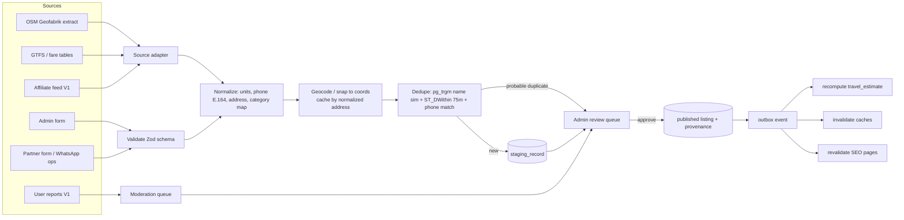

# Livo — Data Strategy

> Data is the product. The AI, the UI and the budget engine are only as good as the listings, prices and travel times underneath. This document is a first-class architecture concern, not an appendix.

## 1. Principles

1. **No scraping assumed legal.** We do not scrape NoBroker, MagicBricks, 99acres, OLX, Housing.com, Google Maps, Zomato, Swiggy, JustDial, Booking.com, MakeMyTrip or similar. Their terms prohibit it and their data is not ours to redistribute. Any exception needs written permission or a licence.
2. **First-party records.** Every listing shown is a Livo record with a known origin.
3. **Field-level provenance.** Price, deposit, food-included, availability, AC, etc. each carry source + observed-at + verifier.
4. **Freshness is computed.** Stale data is still shown, but labelled, and it counts against confidence in budget totals.
5. **Estimates are explicit.** When we have no observed value we use a documented `CostAssumption` (e.g., "Kochi mess, 2 meals/day, median ₹3,000/mo, source: Livo survey 2026-10, n=34"), never an LLM guess.
6. **AI reads, never writes, facts.** LLM output cannot create or modify facts without passing through an admin-reviewed path.

## 2. Provenance model

```
FactProvenance {
  sourceType: VERIFIED | PARTNER | API | ESTIMATED | USER | IMPORTED
  dataSourceId: FK DataSource
  observedAt: timestamptz        -- when the fact was true/observed
  verifiedAt?: timestamptz       -- when a Livo operator confirmed it
  verifiedByAdminId?: FK
  method?: PHONE_CALL | SITE_VISIT | PARTNER_PORTAL | DOCUMENT | API_SYNC | USER_REPORT
  confidence: HIGH | MEDIUM | LOW
}
```

Derived display state (computed at read time):

| Display label | Rule |
|---|---|
| **Verified** | sourceType=VERIFIED and age ≤ TTL |
| **From business** | sourceType=PARTNER and age ≤ TTL |
| **From {API name}** | sourceType=API |
| **Estimated** | sourceType=ESTIMATED (from CostAssumption) |
| **Reported by users** | sourceType=USER (V1+) |
| **May be outdated** | any type with age > TTL |

Freshness TTL per fact type (initial values, tunable in admin settings):

| Fact | TTL | Why |
|---|---|---|
| Monthly rent / nightly price | 45 days | PG rents change at academic/joining seasons |
| Deposit | 90 days | |
| Availability ("beds available") | 7 days | volatile; MVP shows "Call to confirm" beyond TTL |
| Food included / meal plan | 90 days | |
| Amenities (AC, Wi-Fi, bathroom) | 180 days | |
| Operating status (open/closed) | 90 days | closed businesses are a top trust killer |
| Mess prices | 60 days | |
| Fare tables (auto, metro) | on government notification; review quarterly | |

## 3. Source evaluation

Legend: ✅ use in MVP · 🟡 V1+/conditional · ❌ do not use.

| Source | What for | Licensing / ToS | Limits & cost | Reliability / freshness | Attribution | Verdict |
|---|---|---|---|---|---|---|
| **Admin data entry** (phone + site visits) | PGs, hostels, lodges, messes, tiffin | Ours | Staff time: ~15–25 min per listing initial, ~3 min re-verification call | High when fresh; decays | None | ✅ Core |
| **Partner submissions** (owners fill a form / WhatsApp to ops) | Same | Ours via partner agreement (consent to publish) | Free | Medium-high | "Info from property" | ✅ Core |
| **OpenStreetMap** (Geofabrik Kerala extract) | Road network for routing, POIs (pharmacies, ATMs, hospitals as secondary), base map | ODbL — share-alike on derived *databases*; attribution required | Free; self-host | Roads good in Kochi; POI completeness variable | "© OpenStreetMap contributors" | ✅ Routing + tiles; 🟡 POIs (verify before showing as fact) |
| **Google Places Autocomplete + Geocoding** | Resolve user-typed destination ("Infopark Phase 2", "Aster Medcity") | Google Maps Platform ToS: no bulk caching of content except `place_id`; lat/lng caching limited (check current terms); restrictions on use with non-Google maps | India price list; ≈70k free events/month per Essentials SKU (Geocoding, Autocomplete, Compute Routes) as of mid-2026 — **verify at build time** | Excellent | Google attribution where shown | ✅ for destination input only (legal check L-3) |
| **Google Routes API** | Fallback travel time; transit mode spot checks | Same ToS caching constraints | ≈70k free/month Compute Routes Essentials (India) — verify | Excellent, incl. traffic | Required | 🟡 Fallback + calibration of our model |
| **Google Places Details (listing data, reviews, photos)** | — | Cannot be stored/redistributed as our DB; reviews cannot be re-hosted | Paid per call | — | — | ❌ Not as listing source |
| **Ola Maps / Mappls (MapmyIndia)** | Alternative geocoding/autocomplete/routing with Indian focus | Commercial terms, check caching/display rights | Check current pricing | Good India coverage | Required | 🟡 Evaluate as Google alternative (esp. if L-3 blocks Google-on-MapLibre) |
| **Kochi Metro (KMRL) GTFS / open transit data** | Metro stations, headways, fares | KMRL has historically published open GTFS for Kochi Metro; **licence and current availability must be verified** | Free | Good for metro; water metro possibly | As licence requires | ✅ if licence OK; else manual station/fare table |
| **Kerala govt auto/taxi fare notification** | Auto fare rule (min fare + per-km) | Public government order | Free | Changes on notification | Cite order no. | ✅ |
| **KSRTC / private bus** | Bus routes and fares | No reliable open dataset | — | Poor | — | 🟡 Model: bus fare stage table (public) + speed model; label "estimated" |
| **Hotel OTAs / affiliate APIs** (Booking.com Affiliate, Agoda, MakeMyTrip affiliate, etc.) | Hotels for short stays (interviews, attendants, tourists) | Affiliate agreements permit display under their terms; typically require live price display from their feed and link-out | Affiliate approval required; revenue share | Real-time prices | Required | 🟡 V1 (after approval); MVP shows a curated set of budget lodges/hotels near hospitals & offices with "check price" link |
| **Food aggregator APIs** (Swiggy/Zomato) | Restaurant listings/prices | No public partner API for this use; scraping ❌ | — | — | — | ❌ Use messes/tiffin (ops-collected) + cost assumptions for "eating out" |
| **Hospital information** | Name, address, departments (for logistics only), visiting hours | Hospital websites (link, don't copy), NABH registry (public list) | Free | Medium | Link to official site | ✅ Minimal: name, location, official website, main gate coordinates; no clinical info |
| **User-generated** (reports, reviews, price submissions) | Corrections, freshness signals | Ours via ToS + UGC licence | Moderation cost | Variable; fraud risk | "Reported by users" | 🟡 V1: reports + price submissions; V2: reviews |
| **Licensed third-party datasets** (commercial POI vendors) | Scale POIs for expansion | Paid licence | Varies | Varies | Per licence | 🟡 Evaluate at city #3+ |

## 4. MVP data scope (Kochi)

### 4.1 Anchor destinations (seed ~40)
IT/employment: Infopark Phase 1 & 2, SmartCity Kochi, Kakkanad CSEZ, KINFRA Kakkanad, Vyttila Mobility Hub, Edappally (Lulu), MG Road, Marine Drive, Kaloor, Palarivattom, Kochi SEZ, Cochin Shipyard, BPCL Kochi Refinery (Ambalamugal), Kochi Airport (Nedumbassery).
Hospitals: Aster Medcity (Cheranalloor), Amrita Institute (AIMS, Edappally), Lisie Hospital, Rajagiri Hospital (Aluva), Lakeshore Hospital (Maradu), Medical Trust Hospital, Renai Medicity, General Hospital Ernakulam, Ernakulam Medical College (Kalamassery), Sunrise Hospital (Kakkanad).
Education: CUSAT (Kalamassery), Maharaja's College, St. Teresa's College, Rajagiri College (Kakkanad), Model Engineering College (Thrikkakara), KMM/others as demand shows.
Transit hubs: Ernakulam Junction (South), Ernakulam Town (North), Aluva station, Vyttila hub, KSRTC Ernakulam, Kochi Airport.

Plus **any geocoded point** — anchors just get precomputed matrices and SEO pages.

### 4.2 Listings target at launch
| Category | Target | Coverage zones |
|---|---|---|
| PG / hostel (men/women/co-living) | 150–200 | Kakkanad, Infopark–Kusumagiri, Thrikkakara, Edappally, Kalamassery, Palarivattom, Vyttila, Kaloor |
| Budget lodge / hotel / service apartment | 50–80 | Near hospitals (Cheranalloor, Edappally, Aluva, Maradu), railway stations, Kakkanad |
| Mess / tiffin / meal subscription | 60–100 | Same zones |
| Pharmacies, diagnostics, ATMs, laundry | OSM import + spot-verify top ~100 near hospitals | Hospital zones |

### 4.3 Collection playbook (manual ops)
1. Build a zone list; field agent / phone ops discover listings via physical survey, owner referrals, local classified *leads* (only as leads — re-collect facts directly from the owner, do not copy text/photos).
2. Owner consent captured (checkbox + recorded call note) to list and publish contact number.
3. Structured form in admin (same schema as DB) — no free-text prices.
4. Photos: taken by our agent or supplied by owner with licence grant; EXIF stripped.
5. Mark `VERIFIED` with method; schedule re-verification job at TTL.
6. Target throughput: 1 ops person ≈ 20–30 new listings/day by phone after initial discovery; ≈ 100 re-verifications/day.

## 5. Cost assumptions (estimates layer)

`CostAssumption` rows power estimates where no listing fact exists:

| Key | Example value | Unit | Source |
|---|---|---|---|
| `food.mess.2meals.monthly.kochi` | median + p25/p75 | ₹/month | Livo survey (n, date) |
| `food.eatout.meal.budget.kochi` | | ₹/meal | Livo survey |
| `transport.auto.min_fare` | per Kerala notification | ₹ | Govt order no. |
| `transport.auto.per_km` | | ₹/km | Govt order no. |
| `transport.metro.fare_slab` | by distance slab | ₹ | KMRL fare chart |
| `transport.bus.fare_stage` | | ₹/stage | Kerala fare chart |
| `transport.cab.per_km_estimate` | | ₹/km | Livo observation, LOW confidence |
| `mobile.data.monthly` | | ₹/month | Operator plans (date) |
| `laundry.per_kg` | | ₹/kg | Livo survey |
| `essentials.setup.pg` (bucket, mattress?, etc.) | | ₹ one-time | Livo checklist |

Each row: `value`, `p25`, `p75`, `unit`, `region`, `effectiveFrom`, `effectiveTo`, `sourceNote`, `confidence`. Versioned (never updated in place) so saved plans can show "computed with assumptions v2026-10".

**Actual numbers are intentionally not written in this plan** — they must come from the collection sprint, not from memory.

## 6. Ingestion pipeline



Rules:
- **Adapters** implement `SourceAdapter { fetch(since) ; map(raw) → StagingRecord[] }`; one per source; configured in `DataSource`.
- **Idempotency**: `(dataSourceId, externalId)` unique; payload hash to skip unchanged.
- **Retry/backoff**: pg-boss `retryLimit: 5, retryBackoff: true`; dead-letter to `failed_jobs` view in admin.
- **Automated sources never auto-publish over a VERIFIED fact** — they can only create a "suggested change" for review, unless admin marks the source `trustedAutoPublish`.
- **Geocoding** for admin entries uses a map pin (primary) — the operator drops the pin at the gate; address geocode only as a hint. Wrong pins are the #1 cause of wrong distances.
- **Dedupe keys**: normalized phone, trigram name similarity ≥ 0.6 within 75 m, same building/landmark.
- **Closed-business handling**: 2 failed verification calls + no partner response in 14 days → `status=UNVERIFIABLE` (hidden from Recommended, shown with warning in list); user "closed" reports ≥ 2 → priority re-verification.

## 7. Freshness operations

- Nightly job `freshness.sweep`: computes stale facts, enqueues `reverify.listing` tasks ordered by (views last 30 days × staleness).
- Admin **Freshness dashboard**: % listings verified in last 30/45/90 days by zone & type; oldest facts; re-verification queue burn-down.
- Launch SLO: ≥ 80% of *shown* PG prices verified within 45 days.

## 8. Travel-time data

- `travel_estimate(origin_listing_id, destination_id, mode, depart_band) → duration_s, distance_m, fare_paise_min, fare_paise_max, method, computed_at`.
- Precomputed nightly for all published listings × anchor destinations within 25 km, modes: walk (≤ 3 km), two-wheeler/drive (OSRM), auto (drive time × factor + fare rule), bus (see model), metro (GTFS-based if station within walking distance at both ends).
- Arbitrary (non-anchor) destinations: computed on demand for the top N candidates after a radius pre-filter, cached 24 h (our own computation → cacheable).
- **Bus model (MVP)**: straight/OSRM distance × empirical speed (peak/off-peak) + walk to/from nearest known stop + average wait; output as a **range** ("35–55 min"), labelled Estimated. Calibrate monthly against a sample of Google Routes transit queries (within ToS: calibration of coefficients, not storing Google results).

## 9. Geographic strategy

**Start: Kochi / Ernakulam district urban area only.** Reasons: founder's example & likely local knowledge; dense mix of IT parks, hospitals, colleges; heavy in-migration from north Kerala districts (Kannur, Kozhikode, Malappuram) and other states; metro + water metro makes transport modelling tractable.

Expansion gates (all must be true before city #2):
1. Kochi freshness SLO held for 3 consecutive months.
2. Ops cost per active listing known and sustainable.
3. ≥ 30% of plans end in a contact/booking click (proxy for usefulness).

Expansion order candidates: **Thiruvananthapuram (Technopark)** → **Bengaluru** (large relocation market, but competitive and data-heavy) → Coimbatore / Kozhikode → Chennai/Hyderabad. Rationale: Trivandrum reuses Kerala fare rules, language, and ops playbook; Bengaluru is the big prize but should come after the playbook is proven.

Supported location types: city → area/locality (polygon, V1) → coordinates → POI/destination (office, hospital, college, station, custom pin). Cities and areas are rows (`Region` with `kind` and optional `boundary geography(MultiPolygon)`), not enums.
