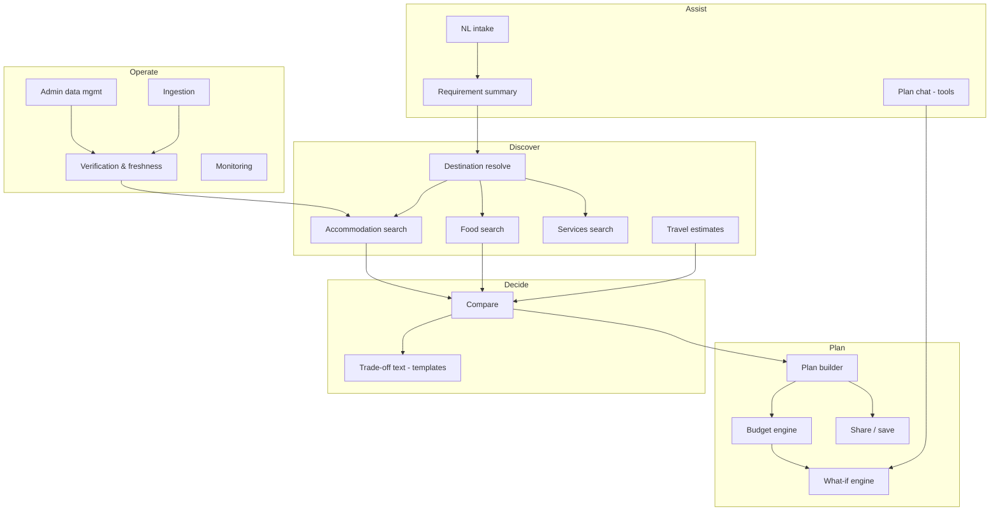
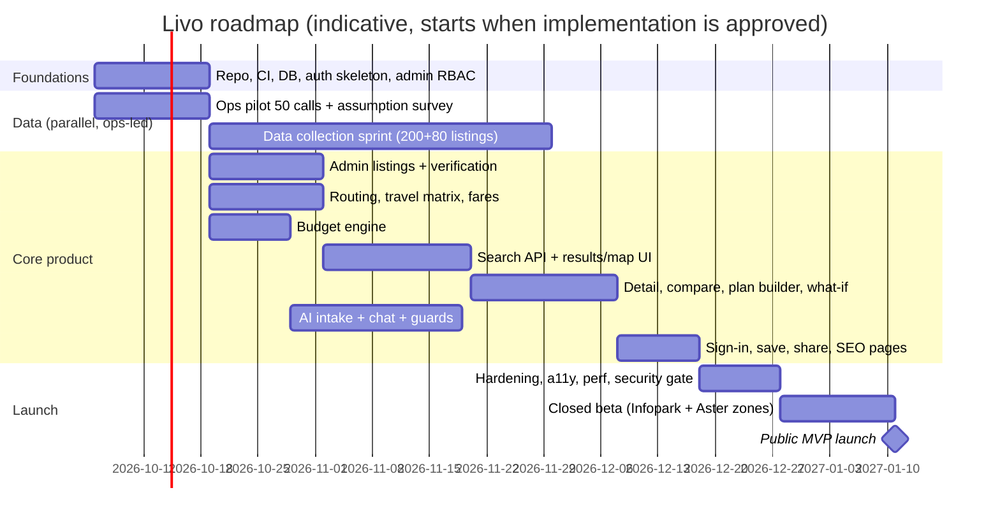

# Livo — Master Plan

> **Status:** planning, pre-implementation · **Date:** 2026-09-26 · **Scope of this repo change:** documentation only.
>
> Companion documents (go there for depth): [ARCHITECTURE](./ARCHITECTURE.md) · [DATABASE_DESIGN](./DATABASE_DESIGN.md) · [API_SPEC](./API_SPEC.md) · [AI_ARCHITECTURE](./AI_ARCHITECTURE.md) · [UX_UI_SPEC](./UX_UI_SPEC.md) · [ADMIN_SPEC](./ADMIN_SPEC.md) · [SECURITY](./SECURITY.md) · [DATA_STRATEGY](./DATA_STRATEGY.md) · [DECISIONS](./DECISIONS.md)
>
> Markers used: **[A-n]** assumption · **[Q-n]** open question · **[R-n]** risk · **[D]** decision · **ADR-n** see DECISIONS.md.

### Repository assessment (pre-planning)

`nihal-spec/Livo` was inspected at planning time: **no commits, no branches, no files.**
- **Reusable code/infrastructure:** none.
- **Technical debt:** none.
- **Implication:** every recommendation is greenfield. The brief's "reuse existing infrastructure" does not apply. The first implementation tasks (§51) create the skeleton described in ARCHITECTURE §10.

---

## 1. Executive Summary

Livo helps people answer one question before they move somewhere temporarily: **"If I stay near *X* for *this long* with *this budget*, where exactly should I stay, and what will it really cost me every month and upfront?"**

It differs from listing sites and trip planners in four ways:
- It starts from the **destination**: an office gate, a hospital or a college, not just a city.
- It computes the **full cost of living there**: rent, deposit, food, commute, essentials and a buffer, with a deterministic engine.
- It shows **trade-offs** instead of a verdict.
- It is **honest about data**: every number shows where it came from and how old it is.

The AI turns messy requests ("15k job near Infopark, no bike, 3 months") into editable requirements and explains results. It never supplies facts.

**Recommendation:** launch in **Kochi only**, with a **curated, phone-verified dataset** of about 200 PGs, hostels and lodges and about 80 messes/tiffin services around about 40 anchor destinations. Build a guest-first responsive web app (Next.js modular monolith, Postgres + PostGIS), a deterministic budget and what-if engine, and a thin, guarded AI layer.

**Not in the MVP:** bookings, reviews, expense tracking, native apps, and every city other than Kochi.

The hardest problem is **data acquisition and freshness**, not the software. The MVP is as much an operations playbook as a codebase.

## 2. Product Vision

Become the default place people in India go **before** a temporary move, to understand where to stay near where they must be, what it will cost, and what to arrange. Livo should be trusted because it is transparent and calculates properly, not because it is the biggest catalogue.

- **Positioning line:** *"Know what living near X will actually cost — before you move."*
- **Workflow:** DISCOVER → COMPARE → PLAN → OPTIMIZE → SAVE → TRACK. TRACK arrives in V1.
- **Core input:** WHERE (exact destination) + WHY + HOW LONG + BUDGET + PREFERENCES.

## 3. Problem

| Pain | Today's workaround | Why it fails |
|---|---|---|
| Don't know which area is near the office/hospital *in commute terms* | Google Maps + asking colleagues | Distance ≠ door-to-door time; bus reality unknown |
| PG prices/deposits opaque, vary by room type | WhatsApp groups, NoBroker/OLX ads, walking around | Stale ads, brokers, no deposit/food info, fake photos |
| Can't estimate total monthly cost vs salary | Mental math | Forget food, commute, deposit, setup costs; run out of cash in month 1 |
| Hospital attendants need a place *now* near a specific gate | Ask at the hospital, touts | Overpaying, far away, no food plan |
| Trip planners ignore month-long stays; listing sites ignore commute & food | Multiple tabs | No single plan, no trade-off view |

## 4. Users / Personas

| # | Persona | Goals | Problems | Constraints | Journey (short) | Edge cases |
|---|---|---|---|---|---|---|
| P1 | **Arjun, 23, first job** (Kannur → Infopark, ₹15k/mo) | Safe cheap PG ≤ 30 min, food sorted, money left over | Doesn't know areas; deposit shock; no bike | ₹15k salary, ~₹10k savings, joins in 10 days | NL intake → summary → results near Phase 1 → compare 3 → plan → budget shows ₹X left/month and upfront gap → what-if "cheaper" → save → contact PG | Salary < total cost; joining date before PG vacancy; gender-specific PG |
| P2 | **Fathima, 19, student** (CUSAT) | Women's hostel near campus, mess, safety | Parents decide; limited info on rules/curfew | Parent budget, academic-year stay | Search CUSAT → filter women + food → share plan link with parent | Parent views shared link on phone; curfew rules important; under-18 users (ToS 18+ [Q-4]) |
| P3 | **Rahul, 27, interview candidate** (Bengaluru → Kochi, 2 nights) | Cheap clean stay near interview venue, reach on time | Short stay; PG monthly pricing useless | 2 nights, ₹1.5k/night | Search destination + 2 nights → lodges/hotels sorted by total → commute at 9 am | Monthly-only PG shows "monthly minimum"; late-night arrival |
| P4 | **Sreeja, 45, patient attendant** (mother at Aster Medcity, 3 weeks) | Stay within walking distance, food, pharmacy, low cost | Stress, time pressure, touts | Unknown duration, fluctuating budget | Quick mode "Stay near Aster Medcity" → lodges ≤ 1.5 km + messes + pharmacies 24×7 → extendable plan | Duration changes weekly; 2 attendants; late-night need; must not get medical advice |
| P5 | **Tourist couple** (Fort Kochi weekend) | Good area, easy transport | Mostly served by OTAs | 2–3 days | Search → hotels (V1 affiliate) → transport estimates | Low priority for MVP; don't over-serve |
| P6 | **Business traveler** (1 week, SmartCity) | Serviced apartment/hotel, cab commute, expense view | Company policy caps | Per-diem | Search → hotel/service apt → budget per day vs per-diem | Needs invoice/GST — out of scope |
| P7 | **Intern/trainee** (6 months, Cochin Shipyard) | Shared PG, bus route, low cost | Stipend low, irregular | ₹8–12k stipend | Like P1, stronger what-if "sharing" | Extremely low budget → dorm/sharing options, nearest-miss |
| P8 | **Family visitor** (4 people, 10 days, relative's wedding / newborn) | Room/apartment for family, food | Group size, kids | Family | Search with people=4 → family-friendly rooms / service apts | Gender policy "FAMILY"; whole-unit pricing |

**MVP priority:** P1, P4, P2, P7 are primary; P3 is secondary; P5, P6 and P8 are served only by what naturally works.

## 5. Use Cases

| ID | Use case |
|---|---|
| UC1 | Find stays near a specific destination within budget and commute limits |
| UC2 | Understand total monthly and upfront cost (salary check) |
| UC3 | Compare 2–3 stays on cost, time and comfort |
| UC4 | Build a plan: stay + food + commute + extras |
| UC5 | What-if: cheaper, closer, food included, duration, transport mode, private room, budget |
| UC6 | Quick mode: somewhere to stay tonight or this week near a hospital or venue |
| UC7 | Share a plan with family (read-only link) |
| UC8 | Save plans and places (account) |
| UC9 | Find essentials near a stay (pharmacy, ATM, laundry, mess) |
| UC10 | Report wrong information |
| UC11 (V1) | Track expenses against plan |
| UC12 (V1) | Business claims and updates a listing |

## 6. Product Principles

1. **Destination first.** Every result is relative to where you must be.
2. **Real numbers or labelled estimates.** Never silent guesses.
3. **Show trade-offs, don't crown winners.**
4. **Guest-first.** Value before sign-up.
5. **AI optional.** Every AI path has a non-AI path.
6. **Mobile-first ergonomics.** Most users arrive on phones, often on 4G.
7. **No dark patterns.** Sponsored content is labelled and never reorders "Recommended".
8. **Logistics, not medicine.**
9. **Small and deep beats big and shallow.** One city done properly first.

## 7. User Journeys

**J1 — Relocation (P1), happy path**
1. Landing → "Describe your situation" → types the Infopark example.
2. Summary shows: Job relocation · Infopark (Phase 1? / Phase 2? chips) · 3 months from [pick date] · ₹15,000 salary · PG · no vehicle. Budget missing → suggested "Max rent?" chip.
3. Picks Phase 1 and ≤ ₹7,000 → results: 23 places ≤ 40 min by bus/walk.
4. Opens 3 → Compare → trade-off sentences.
5. "Add to plan" → plan shows ₹6,500 rent + ₹0 food (included) + ₹900 bus + essentials + buffer = ₹X/month; upfront ₹6,500 + ₹13,000 deposit = ₹19,500 vs cash ₹10,000 → warning plus a "lower deposit" lever.
6. What-if "Lower deposit" → alternative with ₹6,500 deposit, +10 min commute.
7. Save → Google sign-in → plan persisted → "Contact" reveals WhatsApp.

**J2 — Attendant quick mode (P4):** landing chip "Near a hospital" → Aster Medcity → quick results (lodges ≤ 2 km, "call to confirm" availability) + messes + 24×7 pharmacies → extend plan duration from 7 to 21 days → recompute.

**J3 — Parent review (P2):** the student shares the plan link → the parent opens it on mobile (read-only; rules, curfew, cost; "Duplicate to my account").

**Failure journeys** are in §43 (Edge Cases).

## 8. Feature Architecture

## 9. AI

Full design: [AI_ARCHITECTURE.md](./AI_ARCHITECTURE.md).

**MVP AI:**
- Intent extraction into an editable `TripRequirements`.
- Location advisor built on deterministic area aggregates.
- Budget optimizer and what-if by language, mapped to deterministic levers.
- Comparison and trade-off explanations: templates first, model polish optional.
- Plan chat with read-only tools plus scenario creation.

**Deferred:** plan editing via AI with confirmation (V1), checklists (V1, curated), local advisor over curated notes (V1), expense insights (V2), preference learning (Future, opt-in).

## 10. AI Tool / Safety Architecture

- **Controlled tools only:** `resolveDestination`, `searchAccommodation`, `searchFood`, `searchPlaces`, `getRoute`, `compareAreas`, `calculateBudget`, `compareOptions`, `getPlan`, `createScenario`, and `updatePlan` (V1, proposal + confirm).
- **Every tool call:** Zod args with unknown keys rejected, clamped limits, viewer authorization, per-turn and per-conversation budgets, results reduced to IDs, numbers and provenance, and untrusted text fenced.
- **Output guard:** rejects any number or place ID not present in this turn's tool outputs, and falls back to deterministic templates when it does.
- **Never available to AI:** raw SQL, network or file access, admin tools, other users' data, or silent mutations.
- **Cost controls:** spend circuit breaker, per-viewer quotas, and a red-team suite in CI.

## 11. Data Strategy

Full design: [DATA_STRATEGY.md](./DATA_STRATEGY.md).

- **Sources:** first-party listings from admin entry and partner forms, with field-level provenance. No scraping.
- **Maps and routing:** OSM powers routing and tiles. Google is used only for destination autocomplete and geocoding, pending legal check L-3.
- **Transit and fares:** Kochi Metro GTFS if the licence allows, plus Kerala fare orders.
- **Estimates:** versioned cost assumptions from a Livo survey.
- **Freshness:** computed from per-fact TTLs, with a verification queue.
- **Launch SLO:** at least 80% of displayed PG prices verified within 45 days.

## 12. Geographic Strategy

**[D] Kochi (Ernakulam urban) first.** About 40 anchors (IT parks, major hospitals, colleges, transit hubs) plus arbitrary pins.

**Expansion gates** (all must hold before city #2):
- Freshness SLO held for 3 months.
- Ops cost per listing is known.
- At least 30% of plans reach a contact click.

**Expansion order:** Thiruvananthapuram (Technopark), then Bengaluru, then Coimbatore/Kozhikode. Cities and areas are data rows (`Region`), never code.

## 13. Search

Full design: ARCHITECTURE §3–4 and API_SPEC §2.

- **Pipeline:** PostGIS radius pre-filter → precomputed travel-time join → full monthly cost per candidate → hard constraints → Pareto (cost × time) → user priority → **reason chips**. No opaque score.
- **Filters:** price, distance/commute, type, occupancy, gender policy, AC, private bath, food included, amenities, verified only. Availability is shown as "call to confirm" unless verified within 7 days.
- **Sorts:** Recommended, Lowest price, Lowest total cost, Closest. "Best rated" appears only once reviews exist (V2). "Best value" is defined as the lowest total cost that meets all preferred amenities.
- **Empty results** return near-misses and one-tap relaxations.

## 14. Budget Engine

Full design: ARCHITECTURE §5.

- **Determinism:** pure TypeScript, integer paise, versioned engine and assumptions. The same package runs on server and client.
- **Categories:** Accommodation, Deposit, Food, Transport, Activities, Laundry, Groceries, Mobile/data, Essentials, Medical logistics, Misc, Emergency buffer.
- **Frequencies:** one-time, daily, weekly, monthly, per-night and per-meal. Each line is marked fixed or variable.
- **Outputs:** daily, weekly and monthly figures, trip total, setup/upfront, refundable amount, remaining salary, buffer, per-person cost, category breakdown, and a confidence level (count of estimated or stale lines).
- **Key rules:**
  - Deposit is never folded into the monthly figure.
  - A monthly-minimum flag applies when a short stay hits a monthly-priced PG.
  - Food included in rent brings the food line to zero, with a partial-meals top-up.
  - Commute cost = trips per week × fare range.

## 15. What-If Engine

Full design: ARCHITECTURE §6.

- **Scenarios** are named overrides on a plan.
- **Parameter levers** recompute client-side instantly: duration, budget, mode, buffer.
- **Candidate levers** re-run search with derived constraints and deterministic pick rules: cheaper, closer, food included, private room, public transport.
- **Output:** a diff covering Δ monthly, Δ upfront, Δ trip total, Δ daily commute minutes and convenience changes. Base and up to two scenarios can be viewed side by side; any scenario can be promoted to the plan.

## 16. Database

Full design: [DATABASE_DESIGN.md](./DATABASE_DESIGN.md).

- **Schema:** Postgres + PostGIS. About 40 candidate entities are pruned to roughly 30 tables:
  - `Place` + category + detail tables replace separate hotel, PG, hospital and pharmacy tables.
  - The budget is computed, not stored; snapshots are stored on save.
  - Trip is merged into Plan.
  - AdminUser is merged into User + roles.
- **Integrity:** GiST geo indexes, trigram dedupe, CHECK constraints (single owner, money ≥ 0), soft delete where business-meaningful, an append-only audit log, and a retention policy.

## 17. Backend

Modular monolith (ADR-001): Next.js route handlers and server actions, then domain module services, then repositories with Prisma and TypedSQL. A pg-boss worker (ADR-004) and an OSRM container run alongside. Module boundaries and public APIs are in ARCHITECTURE §2 and lint-enforced.

Modules:
- **Core:** auth, rbac, audit, geo (destinations/regions), maps (ports), places (accommodation/food/services), travel (transport), search, budget, plans, scenarios, ai, saved, reports, admin, ingestion.
- **Later:** notifications (V1), expenses (V1), reviews (V2), bookings (future), recommendations (a function inside search, not a module).

## 18. Frontend

- **Framework:** Next.js App Router with RSC for public/SEO pages; client islands for map, filters, plan builder and what-if.
- **UI:** Tailwind + shadcn/ui (owned copies) plus Livo pattern components.
- **Data and forms:** TanStack Query for client data; React Hook Form + Zod (shared schemas) for forms.
- **State:** Zustand only for cross-component ephemeral UI state (compare tray, map ↔ list hover). URL is the state for search filters (shareable).
- **Map:** MapLibre GL, lazy-loaded. **Sheets:** vaul.
- **i18n and analytics:** next-intl; PostHog.

## 19. UX/UI

Full design: [UX_UI_SPEC.md](./UX_UI_SPEC.md).

- **Look:** a utility design system (Inter, tabular numbers, one brand hue, semantic provenance colours with icon and text).
- **Components:** Money, ProvenanceChip, CommuteBadge, ListingCard, CostBreakdown, CompareTable, RequirementSummary, ScenarioDelta, BottomSheet.
- **Screens:** all 30 are specified with MVP/V1/V2 marking.

## 20. Responsive

- **Mobile:** mobile-first, with the 360 px layout tuned separately (thumbnail-left cards). Sticky bottom actions, bottom sheets with 3 snap points, a full-screen map toggle, a compare view that shows 2 columns and swipes to the 3rd, and a budget bar that expands into a sheet.
- **Larger screens:** split list/map from 1024 px, a detail panel over the map, max content width 1440 px.
- **Testing:** a Playwright viewport matrix covers 360, 375, 390, 414, 768, 1024, 1440 and 1920.

## 21. Authentication

Guest-first (ADR-008):
- **Guests:** a signed httpOnly `livo_gs` cookie maps to a hashed `GuestSession` row with a 30-day sliding expiry.
- **Accounts:** Auth.js with Google and email magic link, no passwords, DB sessions.
- **Conversion:** a transactional guest-to-user merge of plans and saved items.
- **Account management:** export and deletion (14-day undo). Secure cookie flags as in SECURITY.
- **Guest can:** search, browse, compare, build temporary plans, calculate budgets, use limited AI and share links.
- **Account adds:** saved plans and places, cross-device access, and (V1) expenses, notifications and reports history.

## 22. Admin / Super Admin

Full design: [ADMIN_SPEC.md](./ADMIN_SPEC.md).

- **MVP modules:** Dashboard, Places (all categories), Destinations, Verification queue, Review queue, Reports, Data sources/sync, Failed jobs, Cost assumptions/fare rules, Users, Guest sessions, Roles, Audit logs, AI monitoring/costs, API usage, Feature flags, System health, Security events, Settings.
- **Later:** Business verification and Notifications (V1); Review moderation (V2).

## 23. RBAC

Permission-based (`resource:action`), with roles as bundles: Super Admin, Admin, Moderator, Data Manager, Support, Business Manager. The full matrix is in ADMIN_SPEC §2. Other controls: step-up 2FA, four-eyes publish, no self-role changes, and at least 2 Super Admins.

## 24. Security

Full design: [SECURITY.md](./SECURITY.md).

It includes a threat model, a controls checklist covering every item in the brief, AI-specific controls, and a launch gate. Hospital-related plans are treated as sensitive data.

## 25. Storage

R2 (ADR-005): private originals and public derived variants, presigned uploads, a worker-side sharp re-encode, EXIF/GPS stripping, and no SVG. Map tiles are served as PMTiles on R2 or via a hosted tile CDN. No images are stored in Postgres.

## 26. Cache

See ARCHITECTURE §11.
- **Search:** Redis with a data-version key, 10-minute TTL and stale-while-revalidate.
- **Place and SEO pages:** ISR with tag revalidation.
- **Routing:** our own OSRM results are stored in `travel_estimate`.
- **Geocoding:** cached only within provider ToS.
- **AI:** no response caching.

## 27. Jobs

pg-boss plus Vercel Cron (ADR-004). Job types:
- `travel.precompute`, `freshness.sweep`, `reverify.enqueue`, `image.process`
- `purge.guest|ai|search`, `seo.revalidate`, `email.send`, `source.sync`, `user.delete`, `user.export`

All jobs are idempotent, with retries, backoff and a dead-letter view in admin.

## 28. Notifications

- **MVP:** transactional email only (magic link, export ready, deletion confirmation) via Resend, Postmark or SES.
- **V1:** in-app inbox and email for:
  - trip reminders ("moving in 3 days — checklist")
  - saved-place price or status changes (only where data changed via verification)
  - report outcomes
  - business claim status
- **V1.5:** PWA push, opt-in, with iOS limitations noted.
- **V2:** review responses.
- **Controls:** per-type preferences and quiet hours (IST). Hospital names never appear in subject lines.

## 29. Analytics

PostHog, with EU cloud or self-hosted, cookieless for guests until consent [Q-6]. Events carry no PII and no hospital names; they use pseudonymous IDs and a destination category rather than the exact destination for sensitive kinds.

| Event | Key properties |
|---|---|
| `search_started` / `search_completed` | destination_kind, anchor_slug (non-hospital), filter_count, result_count, latency_ms, empty |
| `filter_applied` | filter_key |
| `sort_changed` | sort |
| `place_viewed` | place_kind, from (list/map/compare), provenance_level |
| `compare_opened` | n_items |
| `plan_created` / `plan_edited` | purpose, source (ai/form), duration_bucket |
| `budget_calculated` | confidence, has_income, over_budget |
| `scenario_run` | lever, result (found/none) |
| `ai_request` | task, model, latency_ms, tokens_bucket, fallback, error_code |
| `place_saved` / `plan_saved` | — |
| `signup_completed` | method, had_guest_plan |
| `contact_revealed` / `booking_click` | place_kind, channel |
| `report_submitted` | reason |
| `expense_added` (V1), `review_submitted` (V2) | category / rating_bucket |

**North-star metric:** *plans that reach a contact click within 7 days.*

## 30. SEO

- **Indexable page types:**
  - Anchor pages `/stay-near/{anchor}` (e.g. PG near Infopark, hotels near Aster Medcity).
  - Place pages `/p/{slug}`.
  - V1 area × kind pages (`/kochi/kakkanad/pg`) **only when ≥ 10 published listings exist**; otherwise noindex.
- **Page content:** real aggregates (median rents by room type, commute ranges, last updated) and FAQ answers computed from data. No thin programmatic pages and no AI-written filler.
- **Technical:** unique `generateMetadata` titles and descriptions; OG images generated from data (`next/og`); canonical URLs (filters and sort params canonicalize to the base page); JSON-LD `LodgingBusiness`/`Hostel`/`Hotel`/`Restaurant` for places (no fabricated `aggregateRating`), `BreadcrumbList`, `FAQPage` only where visible on page; sitemap index split by type with `lastmod` = last verified; robots disallow `/plan/*`, `/api`, `/admin`, share links, and search result URLs with params.
- **Performance:** ISR with tag revalidation.
- **i18n:** hreflang when ml/hi launch.

## 31. I18N

English only at launch, but i18n-ready from day one: next-intl catalogs, ICU plurals, `en-IN` number formatting, and layouts that tolerate longer strings. Malayalam arrives in V2, with Hindi after it. Locale routing is decided at that point, and UI fonts are reserved for those scripts. Listing names are not translated; area names get `name_ml` in V2. AI extraction accepts Manglish from the MVP.

## 32. Accessibility

WCAG 2.2 AA target, with details in UX_UI_SPEC §7: keyboard access everywhere, list alternatives to the map, focus management in sheets, contrast, labelled forms with error summaries, live regions for counts and totals, 44 px targets, and reduced motion. Checked with axe in CI plus manual screen-reader passes.

## 33. API

Full spec: [API_SPEC.md](./API_SPEC.md). It covers the `/api/v1` conventions (problem+json errors, cursor pagination, paise strings, a provenance object, rate limits and idempotency) and the endpoints for search, places, transport, plans, budget, scenarios, AI (streaming), saved items, account, reviews (V2) and admin.

## 34. Testing

See ARCHITECTURE §14:
- **Engine and logic:** unit tests (budget golden files), integration tests with PostGIS Testcontainers, and API permission-matrix tests.
- **AI:** structured-output evals (200 utterances, Manglish included), a tool red-team suite, and grounding checks.
- **Security:** ZAP baseline scan.
- **End-to-end:** Playwright E2E plus the responsive matrix, axe, Lighthouse CI budgets, a k6 search load test, and budget regression snapshots.

## 35. Observability

See ARCHITECTURE §13:
- **Logs and errors:** pino structured logs with redaction; Sentry across web, server and worker.
- **Dashboards:** API latency, external APIs, AI cost and latency, jobs, freshness, auth failures, and admin security events.
- **Alerts and checks:** alerts with thresholds, plus synthetic health checks.

## 36. Deployment

See ARCHITECTURE §9 and ADR-013:
- **Services:** Vercel (bom1), managed Postgres + PostGIS in Mumbai with PITR, a worker and OSRM on Railway/Fly/Render, R2, and Upstash.
- **CI/CD:** GitHub Actions for CI, preview environments with DB branches, a gated migration job, and expand/contract migrations.
- **Local development:** docker-compose with PostGIS, OSRM and Mailpit.

## 37. Cost

**Do not trust any number here without re-checking the linked pricing pages at build time.** Figures are structural estimates; provider prices change.

| Item | MVP (≤ 5k MAU) | Low traffic (≤ 50k MAU) | Scaling notes |
|---|---|---|---|
| Hosting (Vercel) | Pro plan per seat | Pro + usage (functions, bandwidth) | ISR and caching keep function time low |
| Postgres + PostGIS (Neon/Supabase) | entry paid tier (PITR) | mid tier | read replica only if needed |
| Redis (Upstash) | free/pay-per-request | pay-per-request | |
| Worker + OSRM host | small container + ~4 GB RAM container | same | OSRM rebuild monthly |
| Object storage (R2) | a few GB — negligible, zero egress | low | |
| Map tiles | hosted tile provider free/low tier or self-hosted PMTiles (≈ storage only) | self-host PMTiles | self-host removes per-load cost |
| Geocoding/autocomplete (Google India SKUs) | within ~70k free events/month per SKU (verify) | may exceed → consider Ola Maps/Mappls | session tokens for autocomplete; anchor alias table first |
| Routing | self-hosted: ≈ infra only; Google Routes fallback within free cap | same | |
| AI | extraction (small model) + ~3 chat turns/engaged plan; **set daily cap** | same, with caching of system prompt | cost/plan formula in AI_ARCHITECTURE §8 |
| Email | free tier (few k/month) | low paid tier | |
| Monitoring (Sentry) | developer/team tier | team tier | sample traces |
| Analytics (PostHog) | free tier (1M events/mo historically — verify) | usage-based | |
| **People / ops** (largest real cost) | 1–2 data ops people for listing collection/verification | 2–3 | Ops cost per verified listing is the key unit economic |

**[R-cost]** The two variable risks are Maps APIs (autocomplete per keystroke) and LLM tokens. Mitigations: debounce, session tokens, anchor-first autocomplete, precomputed matrices, per-viewer quotas and a spend circuit breaker.

Pricing references to check:
- Google Maps Platform India pricing: https://developers.google.com/maps/billing-and-pricing/pricing-india
- Google Maps Platform core pricing list: https://developers.google.com/maps/billing-and-pricing/pricing
- The pricing pages of Vercel, Neon/Supabase, Upstash, Cloudflare R2, Sentry, PostHog, and the chosen LLM providers.

## 38. Monetization

Not in the MVP. Evaluated for V1+:

| Option | Fit | Trust risk | Verdict |
|---|---|---|---|
| Affiliate (hotel OTAs) | Good for short stays (P3, P4, P5) | Low if labelled; must not reorder Recommended | **V1 first revenue** |
| Lead generation to PGs (pay per verified lead) | Strong: PG owners pay brokers today | Medium: incentive to push paying PGs | V1.5 with strict separation: leads priced flat, no ranking effect |
| Featured listings | Common | High | Only in a clearly separate "Featured" row, never in Recommended/sorts |
| Business subscriptions (dashboard, analytics, verified badge) | Medium | Medium ("verified" must mean verified by us, not paid) | V2; the badge is not for sale |
| Premium planning (₹ one-time) | Weak: hard to charge individuals | Low | Test later |
| **B2B relocation / employer packages** (HR sends new joiners a plan) | **Strong** in Kochi IT parks | Low | **V1 pilot with 2–3 Infopark companies**: most promising |
| Partnerships (hospitals' attendant desks, colleges) | Distribution more than revenue | Low | V1 |
| Booking commissions | Needs payments and inventory control | Operational/legal | Future |

**Rule:** monetization never changes deterministic ranking. Sponsored items are labelled "Sponsored" or "Featured" and appear in dedicated slots. An audit report of ranking inputs is available internally.

## 39. MVP (≈ 10–12 weeks for 2 engineers + 1–2 data ops; [A-1])

**In:**
- Kochi only; ~40 anchors + custom pins.
- Curated listings: ~200 accommodation and ~80 food, verified and published via admin, plus services from OSM with spot verification.
- Destination autocomplete, search (list + map, filters, 4 sorts), and place detail with provenance.
- Compare (up to 3).
- Guest plans (stay + food + commute + custom lines), a deterministic budget, what-if (5 levers + parameters) and share links.
- AI intake with an editable summary, and plan chat (read tools + scenario creation) behind a flag.
- Sign-in (Google + magic link), saved plans and places, account export/delete.
- Report wrong info; contact reveal.
- Admin: places, verification, review queue, reports, anchors, assumptions, jobs, users, roles, audit, AI/API usage, flags, health.
- SEO anchor pages and place pages.
- Transactional email; PostHog, Sentry, rate limits.

**Out:** bookings/payments, reviews, expense tracking, notifications beyond auth, business self-serve, PWA/push, Malayalam/Hindi, native apps, other cities, affiliate feeds, preference learning, AI plan editing.

**Manual in the MVP:** listing discovery and verification (phone), dedupe decisions, report handling, cost-assumption survey, anchor setup, partner onboarding via WhatsApp and a form filled by ops.

## 40. V1 (+ 8–12 weeks)

- Expense tracker (plan-linked) and trip dashboard.
- PWA with offline plan view.
- Notifications (in-app + email).
- Business claim flow and partner portal.
- Affiliate hotels for short stays.
- Area pages for SEO.
- Curated checklists per purpose.
- AI plan editing with confirmation.
- Local advisor over curated area notes.
- User price submissions and moderation.
- Employer pilot (B2B links).
- Dark mode.
- Commute isochrones on the map.

## 41. V2

Reviews (structured, moderated, verified-stay signals), Malayalam UI, expense analytics, business subscriptions, second city (Thiruvananthapuram), push notifications, and optional preference learning.

## 42. Future

Bengaluru and other metros, booking/payments (after legal and RBI review), native apps if retention justifies them, relocation packages (movers, SIM, bank), multi-currency for international students, and an API for employers/HR platforms.

## 43. Edge Cases

| Case | Handling |
|---|---|
| No accommodation matches | Near-misses + one-tap relaxations; "Tell us — we'll check this area" (ops lead capture) |
| No food data nearby | Use cost assumption (labelled Estimated); show delivery-capable options |
| No transport route / OSRM failure | Distance-based estimate with wide range; label; Google fallback if enabled |
| Incorrect destination location | Show pin on the map in the summary; "Move pin"; entrances for large campuses/hospitals |
| Destination changes mid-plan | Recompute travel for plan items; flag items now outside commute limit |
| Budget/duration changes | Instant recompute; flag monthly-minimum or min-stay violations |
| Unavailable prices | "Price on request"; excluded from price sorts, included with warning in Recommended only if other constraints fit |
| Stale data | "May be outdated" + date; confidence reduced; prioritized re-verification |
| Closed business | Report → re-verify → CLOSED → hidden; saved-by users notified (V1) |
| Duplicates | Dedupe on ingest; admin merge; redirects from merged slugs |
| Fake reviews | No reviews in MVP; V2 structured, verified-stay, rate-limited, moderated |
| Guest session expiry | Warn at 25 days via in-app banner; "Sign in to keep"; share link also expires with plan |
| Offline | MVP: graceful errors; V1 PWA cached plan |
| AI failure | Form-only path; banner |
| Map API failure | List still works; static fallback; autocomplete falls back to anchor alias search |
| Rate limits hit | Clear message + retry-after; never lose form input |
| Currency | INR only; schema has currency column |
| Groups/families | `people` affects occupancy filters and food/transport multipliers; whole-unit options |
| Accessibility needs (wheelchair, ground floor, lift) | Amenity flags (`LIFT`, `GROUND_FLOOR_ROOM`, `STEP_FREE`) collected for hospital-zone listings from MVP |
| Emergency travel (tonight) | Quick mode preset; availability "call to confirm"; prioritize 24h lodges |
| Extremely low budget | Dorm/sharing, mess options, walking distance; honest "not feasible under ₹X — minimum realistic ₹Y" from data |
| Very short stay (1–3 nights) | Nightly-priced results only by default; monthly PGs hidden unless toggled |
| Very long stay (> 6 months) | Suggest room rentals; deposit amortization note; recompute assumptions yearly |
| Deposit unaffordable | Upfront shortfall flag + "lower deposit" lever |
| Gender-policy mismatch | Hard filter when specified; ask when purpose implies PG and it is missing |
| Two destinations (couple working in different places) | V1: multi-destination commute (sum/max); MVP: pick primary |

## 44. Legal / Compliance

See SECURITY §3–4 (L-1…L-12).

- **Headlines:** DPDP Act 2023 + DPDP Rules 2025 (phased; full obligations by **13 May 2027**, consent managers from 13 Nov 2026), Google Maps ToS on caching and display (L-3), ODbL (L-4), owner consent for listing data (L-6), IT Rules 2021 intermediary obligations and fake-review standards (L-7), ASCI disclosure (L-8), medical disclaimer (L-9), not acting as an unregistered property agent (L-10).
- **Before launch:** professional review is required for all of these.

## 45. Risks

| ID | Risk | Likelihood | Impact | Mitigation |
|---|---|---|---|---|
| R-1 | Can't collect/verify enough PG data at acceptable cost | High | Critical | Start with 3 densest zones; partner referrals; measure ops cost/listing in week 1–2; B2B pilots fund ops |
| R-2 | Data goes stale → trust collapse | High | High | TTLs, queue, freshness SLO, visible dates, user reports |
| R-3 | Owners unwilling to share prices publicly | Medium | High | Show ranges ("₹6–7k") when exact not permitted; lead model incentive |
| R-4 | Bus/transit time inaccuracy | High | Medium | Ranges, labels, calibration, user feedback on commute |
| R-5 | Google ToS conflict with MapLibre display | Medium | Medium | L-3 review; Ola/Mappls/Nominatim fallback adapters |
| R-6 | Users don't trust a new brand over WhatsApp groups | Medium | High | Visible verification, phone-verified badge, share-with-family, SEO answers with real data |
| R-7 | AI hallucination leaks through | Low (guarded) | High | Grounding guard, templates, evals |
| R-8 | AI/maps cost spike from abuse | Medium | Medium | Quotas, bot protection, circuit breaker |
| R-9 | Low repeat usage (episodic need) | High | Medium | SEO + B2B + referrals rather than retention-driven growth; V1 tracker for on-ground usage |
| R-10 | Scope creep (the brief is huge) | High | High | This plan's MVP cut; feature flags; "not now" list in §51 |
| R-11 | Sensitive-data exposure (hospital context) | Low | High | Treat as sensitive; minimisation; retention |
| R-12 | Monetization pressure corrupts ranking | Medium (later) | High | ADR-014 rule + internal audit |

## 46. Assumptions

| ID | Assumption | Validate by |
|---|---|---|
| A-1 | Team: 2 full-stack engineers (one strong in frontend), part-time designer, 1–2 data ops people in Kochi | Founder confirmation [Q-1] |
| A-2 | Kochi is the launch market | Founder confirmation [Q-2] |
| A-3 | Users accept "call to confirm" availability in the MVP | Usability test with 8–10 target users |
| A-4 | PG owners share prices when asked by phone (≥ 60% response) | Week-1 ops pilot (50 calls) |
| A-5 | Most traffic will be mobile (≥ 75%) | Analytics |
| A-6 | Kochi Metro GTFS is available under a usable licence | Check KMRL open data |
| A-7 | Budget ranges collected by survey are representative | n ≥ 30 per assumption key |
| A-8 | No payments in the first 6 months | Founder confirmation |
| A-9 | Product name "Livo" is final (domain `livo.app` used as a placeholder only) | [Q-3] |

**Open questions:**
- Q-1 team size and budget
- Q-2 confirm Kochi
- Q-3 brand/domain
- Q-4 minimum user age (18+?)
- Q-5 is B2B employer pilot a near-term goal?
- Q-6 analytics consent approach
- Q-7 preferred LLM vendor contracts or credits
- Q-8 will there be a field team or only phone verification?

## 47. ADRs

[DECISIONS.md](./DECISIONS.md) — ADR-001 … ADR-015:
- modular monolith; PostgreSQL/PostGIS; Prisma + raw geo SQL
- **pg-boss over BullMQ for the MVP**; R2 storage; Postgres search
- AI abstraction (Vercel AI SDK); guest-first auth; responsive web/PWA over native
- map abstraction with OSM routing; first-party data with field provenance; money in paise
- hosting regions; ranking without opaque scores; i18n

## 48. Roadmap

Indicative: about 12 weeks to closed beta and about 14 to public MVP. V1 follows over roughly 3 months, V2 over the following 3–4 months.

## 49. Acceptance Criteria (MVP)

**Product**
- [ ] A guest can go from landing to a saved-able plan with budget in ≤ 3 minutes on a 360 px phone (usability test median).
- [ ] For any anchor, search returns results with commute time, monthly total and provenance for every listed price.
- [ ] Each budget number traces to a line item with a source (verified, partner, estimated) visible in the UI.
- [ ] Budget engine golden tests cover: short stay at monthly PG, food included, partial meals, zero income, deposit > cash, 2 people, 1-night stay, 180-day stay.
- [ ] What-if levers return either an alternative with a correct diff or an explicit "none found + nearest miss".
- [ ] Compare shows cost/time/comfort differences and at least one template trade-off sentence per pair.
- [ ] AI intake extracts the Infopark example into the expected fields, with ≥ 90% field accuracy across the eval set, 0 grounding violations in chat evals, and 0 medical-advice responses.
- [ ] With AI disabled via flag, every MVP flow still works.
- [ ] Guest plan survives sign-in (merge), and export/delete work.

**Data**
- [ ] ≥ 150 published accommodations and ≥ 60 food providers across the launch zones.
- [ ] ≥ 80% of displayed prices verified within 45 days.
- [ ] Every listing has an admin-placed pin checked on satellite imagery.

**Quality**
- [ ] Core Web Vitals targets met on landing/search/place (ARCHITECTURE §12).
- [ ] axe: 0 serious/critical violations on MVP screens.
- [ ] Security launch gate passed (SECURITY §5).

## 50. Production Readiness

- **Infrastructure:**
  - Environments: prod, preview, local; secrets in the provider; config validated at boot.
  - Backups: PITR enabled and a restore drill completed.
  - Rollback: Vercel instant rollback plus backward-compatible migrations.
- **Monitoring:** Sentry release tracking, alerts routed to email/Slack, a status/health endpoint, and synthetic checks.
- **Ops and support:**
  - Runbooks: incident, data breach, provider outage (maps/AI), stale-data spike, abuse spike.
  - On-call: named owners, business hours plus critical alerts.
  - Data ops: verification schedule staffed, and SLO dashboard in admin.
  - Support: contact email, grievance officer contact (IT Rules/DPDP), report handling SLA (48 h).
  - Kill switches and limits: feature flags for AI, chat and SEO pages; spend caps for AI and Maps.
- **Legal:** privacy notice, ToS, disclaimers, cookie/analytics notice, attribution (OSM, map provider).

## 51. First 20 Implementation Tasks

Ordered. Each is a reviewable PR-sized unit. The data ops pilot (A-4) starts in parallel on day 1.

| # | Task | Output / definition of done |
|---|---|---|
| 1 | **Scaffold monorepo**: pnpm + Turborepo, `apps/web` (Next.js App Router, TS strict, Tailwind, shadcn/ui), `packages/{schemas,budget-engine,db}`, ESLint (boundaries rule), Prettier, Vitest, Playwright; GitHub Actions CI (lint, typecheck, test, build) | Green CI on empty app; `env.ts` Zod config |
| 2 | **Database baseline**: docker-compose (postgis, mailpit), Prisma schema for Region, Destination, Place, AccommodationDetail, RoomOption, FoodPlan, Amenity, FactProvenance, DataSource; PostGIS columns + GiST/trgm indexes + CHECKs in migration SQL; seed roles/amenities/regions | `pnpm db:migrate && db:seed` works; integration test with Testcontainers |
| 3 | **Provenance & freshness library**: `provenanceFor(fact)`, TTL config, display-label derivation; `Money` utilities (paise, en-IN formatting) | Unit tests |
| 4 | **Auth + RBAC + audit skeleton**: Auth.js (Google + magic link), DB sessions, Role/Permission/UserRole, `requirePermission`, `withAudit`, TOTP enrollment for admins, `/admin` layout guard | Permission-matrix test harness |
| 5 | **Admin places editor**: list/filter table, structured form (rooms, prices, deposit, food, amenities, rules), map pin placement, per-fact verification entry, status workflow, four-eyes publish, optimistic locking | Data ops can enter and publish a listing end-to-end |
| 6 | **Photo pipeline**: presigned R2 upload, worker re-encode/strip EXIF, alt text, ordering | Upload test; no originals public |
| 7 | **Worker + pg-boss**: `apps/worker`, `JobQueue` interface, cron via Vercel Cron, failed-jobs admin view | Demo job with retries visible in admin |
| 8 | **Anchors & destination resolution**: anchor seeding with aliases and entrances; `Autocomplete`/`Geocoder` ports with Google (India) adapter + anchor-first merge; custom pins | Autocomplete API + component with combobox a11y |
| 9 | **Routing & travel matrix**: OSRM Kerala build script, `RoutingProvider` adapter, `TravelEstimate` precompute job per (listing × anchor), fare rules (auto/metro/bus) + transit estimator v0 (ranges) | Matrix for seed data; unit tests for fares |
| 10 | **Budget engine package**: types, line-item builder, proration, aggregation, affordability, confidence; golden-file tests (all cases in §49) | ≥ 95% branch coverage in engine |
| 11 | **Cost assumptions & fare rules admin** (versioned) + seed from ops survey CSV | Engine consumes versioned assumptions |
| 12 | **Search service + API**: TypedSQL candidate query, full-cost computation, Pareto ranking, reason chips, facets, near-misses, Redis cache with dataVersion | p95 < 400 ms on seed×10 data (k6) |
| 13 | **Results UI**: URL-state filters, list, MapLibre map with clusters, mobile bottom sheets and full-screen map, skeleton/empty/error states | Playwright at 360/390/1024/1440 |
| 14 | **Place detail page** (RSC + ISR): rooms table, "your cost here", commute, food, amenities, provenance, contact reveal, report | JSON-LD valid; Lighthouse budgets |
| 15 | **Guest sessions + plans**: middleware cookie, GuestSession, Plan/PlanItem services, plan builder UI with sticky budget bar/rail, share link | Guest can build and share a plan |
| 16 | **Compare**: tray, table (differences toggle), template trade-off sentences, mobile swipe layout | a11y table semantics |
| 17 | **What-if engine + UI**: ScenarioOverrides, parameter levers client-side, candidate levers server-side, ScenarioDelta cards, apply to plan | Tests per lever incl. none-found |
| 18 | **AI intake**: LLM port (Vercel AI SDK), `extractRequirements` with Zod structured output, anchor resolution, RequirementSummary UI, eval harness (≥ 100 labelled utterances to start), feature flag, quotas | Eval ≥ 90% field accuracy on set |
| 19 | **AI plan chat + guards**: tool registry (read tools + createScenario), authz/clamps/budgets, result reducer, grounding output guard, template fallback, streaming UI, AI usage logging + admin view, spend circuit breaker, red-team tests | 0 grounding violations in eval |
| 20 | **Accounts, SEO & launch hardening**: sign-in merge, saved plans/places, export/delete jobs, anchor SEO pages + sitemap/robots/canonical, PostHog events, Sentry, rate limits everywhere, CSP, security launch gate checklist | MVP acceptance criteria (§49) pass |

**Build first:** tasks 1–5 plus the ops pilot. The admin places editor with provenance is the first user-facing thing to ship, because data collection is the critical path and it needs a tool on day 10, not day 60.

---

## Critical Product Challenge

**What is unnecessary or should be removed from the brief (for now)?**
- Separate tables for Hospital, Pharmacy, ServiceProvider, Business, Trip, Budget and Rating (merged or computed).
- A standalone "recommendations" module (it is a search function).
- "Best rated" sort without reviews, and meaningless "value scores".
- OpenSearch/Elasticsearch; BullMQ + Redis as a job system in the MVP.
- Push notifications; expense analytics; preference learning.
- A tourist-focused experience competing with OTAs.
- AI checklists (use curated ones) and an AI "local advisor" without curated content.

**Hardest to build:**
- A reliable, fresh dataset (operations).
- Believable multimodal transit time estimates for buses.
- AI that is genuinely grounded (guard + evals).
- A 360 px comparison and budget UX that stays readable.

**Expensive:**
- Data ops salaries (the dominant cost).
- LLM usage if unguarded, and Google Maps usage if autocomplete is naive.
- Photo collection, and later a review moderation team.

**Requires partnerships:**
- PG/hostel owners (data consent, leads) and OTA affiliate programs.
- Employers/HR for B2B distribution, hospital attendant desks, and colleges.
- Possibly KMRL for official transit data.

**Hardest data to obtain:**
- Current PG prices, deposits, bed availability and food quality.
- Mess prices and timings.
- Bus routes and frequencies.
- Reliable closures.

**What could fail operationally:**
- Verification backlog leads to stale prices and lost trust.
- The OSRM/worker host goes down (travel times stop updating; cached values keep working).
- AI provider outage (form fallback).
- Admin mistakes (four-eyes, audit and rollback via history).
- Spam reports or abuse (rate limits, moderation).

**What is the real MVP?** "Kochi destination → verified stays + food → true monthly/upfront cost → compare → what-if → shareable plan", with an optional AI intake. Everything else waits.

**Do NOT build yet:**
- bookings/payments, reviews, native apps, expense tracking, notifications, business self-serve
- multi-city, i18n translations, OpenSearch, microservices, preference learning, affiliate integration

**Operate manually at first:**
- Listing discovery and verification, partner onboarding and dedupe.
- Report handling and cost surveys.
- Anchor creation, SEO page curation and B2B pilots.

**Postpone:** everything in §40–42, and dark mode, isochrones and multi-destination commutes.

---

## Final Recommendation

**Product positioning.** A destination-centric cost-of-staying planner: *"Know what living near X will actually cost — before you move."* It is not a listing marketplace, a trip planner or a chatbot. Livo is a decision tool whose moat is verified local data plus honest calculation.

**MVP scope.** Kochi only, about 40 anchors, about 200 verified stays and 80 food providers. Search, list/map and details; compare; plan; deterministic budget; what-if; guest plans with share links; sign-in to save; AI intake plus a guarded plan chat; a full admin for data ops. No bookings, reviews, expenses, notifications or native apps (§39).

**Architecture.**
- Next.js modular monolith on Vercel (Mumbai).
- Postgres + PostGIS (Prisma + TypedSQL for geo).
- pg-boss worker for jobs; self-hosted OSRM for routing; Upstash Redis for rate limits and cache; R2 for images; MapLibre + OSM tiles.
- Google (India SKUs) only for destination autocomplete and geocoding.
- A pure-TypeScript budget/what-if engine.
- A Vercel AI SDK provider abstraction with a controlled tool registry and a grounding guard.
- PostHog + Sentry.

**Biggest technical risk.** Travel-time accuracy for buses and multimodal trips in Kochi. Mitigate with ranges, labels, periodic calibration and user feedback. Close second: keeping the AI strictly grounded, handled by the output guard and evals.

**Biggest product risk.** Users may not trust a new site over WhatsApp groups and word of mouth, and the need is episodic (low retention). Mitigate with visible verification, family sharing, SEO pages that answer real questions with real numbers, and B2B employer and hospital distribution.

**Biggest UX risk.** Cognitive overload: cost breakdowns, provenance and comparisons on a 360 px screen. Mitigate with progressive disclosure, one primary action per view, sticky budget bars and usability tests with real movers before launch.

**Biggest data risk.** Acquiring and keeping PG prices, deposits and availability fresh without scraping, at a sustainable ops cost per listing. Validate in the first two weeks with a 50-call pilot, before heavy engineering.

**Biggest cost risk.** Data operations headcount (structural), then unbounded LLM and Maps API usage (variable). Control the variable part with quotas, anchor-first autocomplete, precomputed matrices, caching and spend circuit breakers.

**Key assumptions.**
- Kochi is the launch market.
- A small team (2 engineers + 1–2 ops).
- PG owners will share prices by phone.
- "Call to confirm" availability is acceptable at first.
- Mobile-dominant traffic.
- No payments for 6 months.
- Kochi Metro GTFS usability.

(§46 has the full list and open questions.)

**First 20 implementation tasks.** See §51. Start with the scaffold, DB and provenance model, auth/RBAC/audit and the **admin listings editor**, while ops runs the pricing pilot in parallel.

---

## Research sources (checked 2026-09-26)

- Google Maps Platform India pricing: https://developers.google.com/maps/billing-and-pricing/pricing-india
- Google Maps Platform pricing overview: https://developers.google.com/maps/billing-and-pricing/overview
- DPDP Rules, 2025 (PIB): https://www.pib.gov.in/PressReleasePage.aspx?PRID=2190014
- DPDP Rules 2025 notified document: https://static.pib.gov.in/WriteReadData/specificdocs/documents/2025/nov/doc20251117695301.pdf

**To verify at build time:** current LLM provider pricing, hosting/DB/Redis/R2/Sentry/PostHog pricing, KMRL GTFS licence, Kerala auto/taxi fare order in force, Google ToS on caching and non-Google map display, Ola Maps and Mappls terms.
