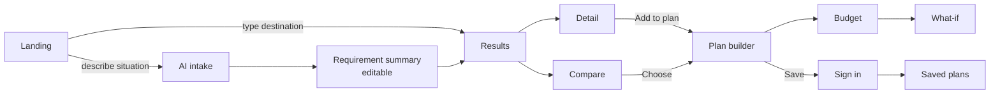

# Livo — UX/UI Specification

## 1. Design intent

Livo is a **decision tool for money and distance**. The UI must look like a trustworthy utility (think a well-made banking/transit app), not an "AI SaaS". Numbers, provenance and trade-offs are the hero; AI is a helper you can ignore.

**Do:** light default theme; strong typographic hierarchy; tabular figures for all money; plain labels; progressive disclosure; one primary action per view; honest data labels.
**Don't:** gradients, glassmorphism, sparkle icons, chat-first landing, card-within-card, decorative animation, giant empty hero, dark mode by default.

## 2. Design system

### Tokens
| Token | Value / rule |
|---|---|
| Font | **Inter** (UI) with `font-variant-numeric: tabular-nums` for money; **Noto Sans Malayalam / Noto Sans Devanagari** reserved for i18n (same metrics tier) |
| Type scale | 12 / 14 / 16 (body) / 18 / 20 / 24 / 30; line-height 1.5 body, 1.25 headings; body never < 16 px on mobile inputs (avoid iOS zoom) |
| Spacing | 4-pt grid: 4, 8, 12, 16, 24, 32, 48 |
| Radius | 6 (inputs, chips), 10 (cards/sheets) |
| Color – neutrals | slate scale; text `#0f172a` on `#ffffff`; muted `#475569` (≥ 7:1 / ≥ 4.5:1) |
| Color – primary | one brand hue (deep teal) for primary actions & selected states only |
| Semantic | success (verified), warning (estimated/stale), danger (over budget), info (API-sourced); never color-only — always icon + text |
| Elevation | 2 levels: flat surfaces with 1 px borders; shadow only for sheets/popovers |
| Motion | 150–200 ms ease-out for sheet/popover; none for data changes except number count-free swap; `prefers-reduced-motion` → no transitions |
| Dark mode | V1, token-driven; not default |

### Core components (beyond shadcn primitives)
- **`Money`** — formats paise → `₹6,500` (en-IN grouping), `/mo`, `/night`; ranges `₹6–7k`; always tabular.
- **`ProvenanceChip`** — `Verified · 12 days ago` / `Estimated` / `From property` / `May be outdated`; tooltip/sheet explains source.
- **`CommuteBadge`** — mode icon + `25–40 min` + fare range.
- **`ListingCard`** — photo (4:3), name, kind, room line, price+basis, monthly total, commute, 2–3 reason chips, save.
- **`CostBreakdown`** — grouped lines (Setup / Monthly / Trip total), each line with provenance dot, expandable.
- **`CompareTable`** — sticky first column (attribute), up to 3 columns, "differences only" toggle, best-in-row subtle highlight (no "winner" badge).
- **`RequirementSummary`** — editable chip groups: Where · Why · When · Who · Budget · Stay · Food · Getting around.
- **`ScenarioDelta`** — `+₹1,200/mo · −18 min/day · +₹4,000 upfront` with arrows + words.
- **`BottomSheet`** (vaul) — 3 snap points (peek 25%, half, full) for mobile detail/filters/map list.
- **`EmptyState`**, **`ErrorState`**, **`Skeleton`** — each with a next action.
- **`AssistantPanel`** — right rail on desktop, full-screen sheet on mobile; always optional.

## 3. Information architecture

```
/                         Landing (search-first)
/search?dest=…            Results (list + map)
/p/[slug]                 Place detail (accommodation/food/service)
/compare?ids=…            Compare
/plan/new                 Planner intake (NL or form) → summary
/plan/[id]                Plan builder (tabs: Overview · Stay · Food · Getting around · Budget · What-if · Checklist(V1))
/plans                    Saved plans
/saved                    Saved places
/stay-near/[anchor]       SEO anchor pages (e.g. /stay-near/infopark-kochi)
/kochi/[area]/[kind]      SEO area pages (V1, only where data depth exists)
/account, /account/preferences, /signin
/admin/*                  Admin
```

## 4. Primary flow



## 5. Screens

Format per screen: Purpose · User goal · Data · Components · Interactions · Desktop · Mobile · Loading · Empty · Error · Accessibility. MVP screens are fully specified; V1+ screens are specified to the level needed to not block architecture.

### 5.1 Landing — MVP
- **Purpose:** get to a useful result in one step. **Goal:** "show me where to stay near X for my budget".
- **Data:** anchor destinations (popular chips), trust stats (e.g., "212 places, 81% verified in last 45 days" — real numbers from DB).
- **Components:** headline (one line, e.g. "Plan your stay near work, college or hospital — with real costs"), destination autocomplete, purpose selector (chips), duration + budget (optional, collapsed), CTA "See places & costs"; secondary link "Describe your situation instead" → AI intake; popular destinations; "How costs are calculated" explainer; footer disclosures.
- **Interactions:** autocomplete shows anchors first with kind icon; Enter on a single anchor match goes straight to results.
- **Desktop:** two-column: search block left (max 560 px), right a static example cost breakdown (real data sample) — not an illustration. **Mobile:** search block at top within first viewport (no hero image), popular chips horizontally scrollable.
- **Loading:** none (static/ISR). **Empty:** n/a. **Error:** autocomplete failure → free text + "we'll locate it" fallback.
- **A11y:** combobox ARIA pattern for autocomplete; labelled inputs; skip link.

### 5.2 Destination search (autocomplete) — MVP
- Combobox with sections: *Popular in Kochi* (anchors), *Places* (geocoder), *Use a pin on the map*. Ambiguity resolution (Infopark Phase 1 / Phase 2 / "Anywhere in Infopark") via follow-up chips.

### 5.3 AI planning input — MVP
- **Purpose:** capture a messy situation. **Components:** single textarea with 3 example prompts (tap to insert), language hint "English or Manglish is fine", privacy note ("Don't include ID numbers"), submit.
- **Loading:** immediately navigates to summary with skeleton chips filling as extraction streams (max 6 s then form).
- **Error:** "Couldn't understand fully — fill in the rest" with partial form. **A11y:** `aria-live=polite` announces "Summary ready".

### 5.4 Planning conversation — MVP-light
- Only after a plan exists; chat in `AssistantPanel`. Messages render `[[place:ID]]` as mini cards; proposals as diff cards with **Apply**/**Dismiss**. Suggestions chips: "Make it cheaper", "Closer to office", "Food included options". Never the only way to do something.

### 5.5 Requirement summary — MVP
- **Purpose:** turn AI (or form) input into explicit, editable filters. **Layout:** grouped rows `Where / Why / When / Who / Money / Stay / Food / Getting around`; each value is a chip → tap opens an editor popover (desktop) / bottom sheet (mobile). Low-confidence values have a dotted underline + "Check this". Missing-but-important fields (dates, gender policy for PGs) prompt inline.
- **CTA:** sticky "Show places" (mobile sticky bottom bar). **A11y:** each chip is a button with full label "Budget: ₹10,000 per month, edit".

### 5.6 Search results — MVP
- **Data:** results API; facets; destination.
- **Desktop (≥1024):** 3 regions — filter bar (top, horizontal, "More filters" drawer), list (left, 480–560 px), map (right, fluid). Hover card ↔ pin highlight. Detail opens in a right-side panel over the map (URL updates `/p/slug` via intercepting route) so list context is preserved.
- **Tablet (768–1023):** list full width + floating "Map" toggle; filters in drawer.
- **Mobile (<768):** list-first; sticky top with destination summary + "Filters (3)" + "Sort"; floating "Map" pill toggles full-screen map with bottom-sheet carousel of cards; filters open full-height sheet with sticky "Show 42 places".
- **Header summary line:** "51 places within 30 min of Infopark Phase 1 · 38 verified".
- **Sort:** Recommended (with "How we rank" link), Lowest price, Lowest total cost, Closest.
- **Loading:** skeleton cards (6) + map without pins; keep previous results dimmed while refetching filters.
- **Empty:** use `nearMisses`: "Nothing under ₹6,000 within 30 min. 7 places at ₹6,000–7,000 · 12 places within 45 min" with one-tap relax buttons.
- **Error:** inline retry; if map fails, list still works ("Map unavailable").
- **A11y:** list is a `<ul>` of articles; map is supplementary (`aria-hidden` pins mirrored in list); result count announced on filter change.

### 5.7 Map / list — MVP
- MapLibre; clustered pins with price labels (`₹6.5k`); destination marker distinct (building icon + label); optional commute-time isochrone ring (V1). Full-screen on mobile with "Search this area". Attribution always visible.

### 5.8 Accommodation details — MVP
- **Sections (order):** photo strip → name, kind, gender policy, area → **price block** (room options table: occupancy, AC, bath, price/basis, deposit, availability, provenance) → **your cost here** (CostBreakdown using the user's requirements: monthly total, upfront, commute) → commute to destination (modes) → food (included? nearby messes) → amenities (icon + text grid) → rules (curfew, notice, min stay) → location (static map + landmark) → nearby essentials (pharmacy, ATM, laundry) → source & last verified → report wrong info.
- **Actions:** primary "Add to plan"; secondary "Compare", "Save", "Contact" (reveals phone/WhatsApp; logs).
- **Mobile:** sticky bottom bar: price summary + "Add to plan"; sections as collapsible headings after the fold.
- **Empty photo:** neutral placeholder with kind icon, no stock photos.

### 5.9 Food details — MVP
- Plans table (meals, veg/non-veg, price/basis, delivery), timings, distance/delivers-to-you, monthly estimate for your meal pattern, provenance, contact.

### 5.10 Transport details — MVP (inside plan & detail)
- Per mode: time range, distance, fare range, frequency note, method label ("Estimated from road network + Kerala auto fare order"). Door-to-door breakdown (walk 6 min → bus 22–35 min → walk 4 min).

### 5.11 Place details (services) — MVP-light
- Name, category, distance/time from your stay & destination, hours if known, official link, provenance. Hospitals: gate(s), visitor logistics links, disclaimer. **No clinical content.**

### 5.12 Comparison — MVP
- Up to 3. Rows grouped: **Cost** (rent, deposit, food, commute, monthly total, upfront, trip total) · **Time** (door-to-door, mode) · **Room** (occupancy, AC, bath) · **Living** (food included, Wi-Fi, laundry, rules) · **Trust** (verified date, source).
- "Show differences only" toggle; cheapest/closest cells subtly marked with text label; auto-generated trade-off sentence per pair built from deterministic templates ("B saves ₹1,400/mo but adds ~35 min/day of commute").
- **Mobile:** 2 columns visible, horizontal swipe for 3rd with sticky attribute column; or "stacked diff" view toggle.
- Compare tray persists across results (bottom bar "Compare (2)").

### 5.13 Plan builder — MVP
- **Layout desktop:** left: sections (Stay, Food, Getting around, Extras) each with chosen item or "Choose" CTA; right sticky: **Budget summary** (monthly, upfront, trip total, remaining salary, confidence).
- **Mobile:** single column; budget summary collapsed into sticky bottom bar ("₹11,850/mo · ₹19,500 upfront ▲") expanding into a sheet.
- **Interactions:** swap item (opens filtered results in a sheet), edit dates/people, add custom cost line, share link, save (triggers sign-in if guest).

### 5.14 Budget — MVP
- Toggle view: **Monthly / Trip total / Daily**. Sections: Setup (one-time), Recurring, Buffer, Totals, Salary check. Each line: label, amount, frequency, provenance dot, edit (for user-owned lines). Affordability flags as plain alerts ("Upfront ₹19,500 is more than cash on hand ₹12,000 — options: PGs with lower deposit (6)").
- **A11y:** real `<table>` with captions; totals announced.

### 5.15 What-if simulator — MVP
- Lever chips: Cheaper · Closer · Food included · Shorter/longer · Public transport · Private room · Budget ₹…; each run creates a scenario card with `ScenarioDelta` and the alternative chosen; compare base vs up to 2 scenarios side-by-side; "Apply to plan". Instant client recompute for parameter levers; spinner only for candidate levers.

### 5.16 Saved plans — MVP
- List: title, destination, dates, monthly total, last updated, "prices changed" badge if recompute differs from snapshot.

### 5.17 Trip dashboard — V1
- For active plans: countdown, checklist progress, key contacts, commute card, this month's spend vs plan.

### 5.18 Expense tracker — V1
- Quick-add (amount, category, date) optimized for one hand; recurring expenses from plan pre-filled; offline queue (PWA).

### 5.19 Expense analytics — V2
- Planned vs actual by category, burn rate, projections; no AI required.

### 5.20 AI assistant — MVP-light
- See 5.4. Global entry point is a text button "Ask about this plan", not a floating sparkle.

### 5.21 Preferences — MVP-light (users)
- Diet, gender policy, commute tolerance, default buffer %, language (V2). Used to prefill requirements.

### 5.22 Profile — MVP
- Name, email, sign-in methods, export data, delete account (with consequences explained).

### 5.23 Auth — MVP
- Triggered contextually ("Save this plan"); modal/sheet with Google + email link; explains guest data carries over. No forced sign-up anywhere else.

### 5.24 Business listing — V1
- Claim flow (search your property → verify by phone OTP/call-back → edit facts → submitted for review); dashboard of views/contacts.

### 5.25 Reviews — V2
- Structured (cleanliness, food, safety feel, value) + text; "stayed here" confirmation; business response; moderation state visible to author.

### 5.26 Notifications — V1
- In-app inbox + email preferences per type.

### 5.27 Loading / empty / error states — MVP (system-wide)
| State | Rule |
|---|---|
| Loading | skeletons matching final layout; never full-screen spinners after first paint; > 5 s → explanatory text |
| Empty | explain why + offer the smallest relaxation that yields results |
| Error | say what failed, what still works, retry; keep user input |
| Offline | banner; cached plan view readable (PWA V1) |
| Stale data | inline "May be outdated · last checked 63 days ago" — not hidden |
| AI unavailable | banner in AI surfaces only; forms remain |

### 5.28–5.30 Admin — see [ADMIN_SPEC.md](./ADMIN_SPEC.md)
Admin UI: dense tables (TanStack Table), left nav, keyboard shortcuts, desktop-first (≥ 1024), mobile read-only.

## 6. Responsive rules

| Breakpoint | Layout decisions |
|---|---|
| 360–414 | single column; 16 px side padding; touch targets ≥ 44 px; sticky bottom action bar (safe-area inset); bottom sheets for filters/detail/budget; compare 2 columns + swipe; map full-screen toggle; no hover-dependent UI |
| 360 specifically | card photo 88 px thumbnail left layout instead of full-width photo to fit 3+ results per screen; price and commute on one line with truncation rules |
| 768 (tablet) | list full width, map toggle; filters drawer; plan builder single column with budget sheet |
| 1024 | list + map split (list 480 px); detail panel over map |
| 1280–1440 | list 560 px; plan builder two-column with sticky budget rail |
| ≥ 1920 | max content width 1440 px centered; map expands; no extra columns of content |

Test matrix enforced in Playwright (see Architecture §14).

## 7. Accessibility (WCAG 2.2 AA target)
- Semantic landmarks; one `h1` per page; logical heading order.
- Full keyboard: filters, map alternatives (list), sheets (focus trap + Esc + return focus), compare table navigation.
- Focus visible (2 px outline, 3:1 contrast).
- Contrast ≥ 4.5:1 text, 3:1 UI; provenance/budget states never color-only.
- Forms: visible labels, inline errors linked via `aria-describedby`, error summary on submit.
- Live regions: result counts, budget total changes, AI streaming (polite, throttled).
- Touch targets ≥ 44×44; spacing between adjacent targets.
- `prefers-reduced-motion` respected; no auto-playing carousels.
- Money read correctly by screen readers (`aria-label="6,500 rupees per month"`).
- Language attribute switches for Malayalam/Hindi content (V2).

## 8. i18n
- `next-intl`; all strings in `messages/en.json` from day one; ICU plurals; no string concatenation.
- Locale routing deferred (V2) — decide `/ml/...` prefix vs cookie then; SEO pages would use prefixed routes + `hreflang`.
- Numbers `en-IN` (lakh grouping) for all locales; dates `Asia/Kolkata`.
- Layout tolerant to 30–40% longer strings (Malayalam) — no fixed-width buttons.
- Data (place names) not translated; area names get optional `name_ml` in V2.

## 9. SEO pages UX (MVP: anchors only)
`/stay-near/infopark-kochi`: H1 "Places to stay near Infopark, Kochi"; summary box with real aggregates (median PG rent by room type, commute ranges, counts, last updated); top 10 listing cards (by Recommended for default profile); area breakdown; FAQ from real data ("How much is a PG near Infopark?" answered with live median + range + date). Pages without ≥ 10 published listings are `noindex`.
